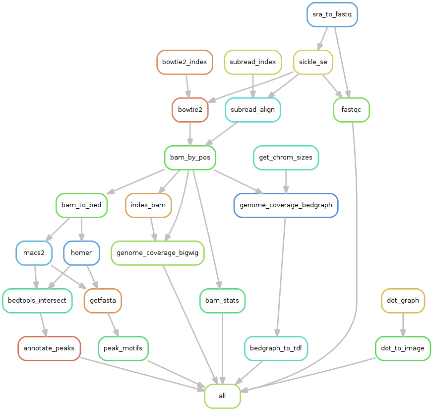

# France Genomique  Workpackage 2.6 - Gene Regulation  
*Claire Rioualen - Sept. 19th, 2016*

This git repository holds shared code for the analysis of Next
Generation Sequencing data related to gene regulation: ChIP-seq,
RNA-seq, and related technologies. 

The goals are multiple.

1. Avoid duplication of efforts by sharing the developments of
different bioinformaticians involved in ChIP-seq and RNA-seq projects.

2. Ensure portability and re-usability of the code.

3. Enable validation of the code by independent users.


We have chosen to use the [Snakemake workflow management system](https://bitbucket.org/snakemake/snakemake/wiki/Home)[1] 
in order to build reproducible and flexible NGS analysis pipelines.

# Snakemake workflows

Snakemake is a tool that enables the creation of analysis pipelines, based on the python language and the make concepts of rules and targets. 

A rule contains the commands to generate a given target. 
A workflow can be defined as a series of files generated by successive rules. 

Here, we present a repository of reusable NGS-specific rules, as well as a few workflow examples for standard ChIP-seq and RNA-seq analyses. 

**A tutorial on Snakemake** basic usage is available in the doc section: [`doc/snakemake_tutorial`](doc/snakemake_tutorial).

# Workflow example

In the [example directory](https://github.com/rioualen/gene-regulation/blob/master/examples) you will find several case studies. Each study includes the following files:

  * `config.yml`, a configuration file that contains the necessary paths and parameters
  * `samples.tab` contains a list of sample IDs, and possibly any additional info on samples
  * `design.tab` contains the samples to be compared (typically, pairs of ChIP/input in a ChIP-seq study)
  * `README.md`, a file describing how to execute the corresponding workflow

Follow the instructions in the `README.md` file in order to execute the whole workflow. 

The workflow can generate a flowchart of the analysis, here is the chart for ChIP-seq_SE_GSE20870 study case:



# Virtualization

**Full tutorials** can be found in the `doc` section, including the creation of a virtual machine/docker container, the installation of all the tools and dependencies and the execution of the workflows: [`doc/gene-regulation_tutorials`](doc/gene-regulation_tutorials).

These tutorials have been developed for ChIP-seq studies; however RNA-seq pipelines are soon to be included. 

# Pre-requisites

We recommand using one of our [tutorials on virtualization](doc/gene-regulation_tutorials), in order to run the workflows under a unix system without damaging your installation. 

However, this repository contains a makefile that installs all the tools and dependencies used by gene-regulation. 
*[NB currently only ChIP-seq dependencies are included, RNA-seq specific tools are to be included soon.]*

```
make -f gene-regulation/scripts/makefiles/install_tools_and_libs.mk all
source ~/.bashrc
```

It includes:

* R 3+
* Python 2.7/3.4
* Snakemake 3.4+
* [SRA Toolkit](http://www.ncbi.nlm.nih.gov/Traces/sra/sra.cgi?view=software)
* [Sickle](https://github.com/najoshi/sickle)
* BWA
* Bowtie
* [Bowtie 2](http://bowtie-bio.sourceforge.net/)
* [SAMtools 1.3+](http://samtools.sourceforge.net/)
* [FastQC](http://www.bioinformatics.babraham.ac.uk/projects/fastqc/) (0.11.2+)
* [bedtools](http://bedtools.readthedocs.org/)
* [HOMER](http://homer.salk.edu/homer/index.html)
* MACS 14 (1.4.3)
* [MACS2](https://github.com/taoliu/MACS/)
* [SWEMBL](http://www.ebi.ac.uk/~swilder/SWEMBL/)
* subread
* ... (to be updated)


# Documentation

More documentation can be found in the `doc` directory.

It includes: 

* A Snakemake tutorial section (`snakemake_tutorial`)
* General tutorials on NGS tools installation, RSAT installation... (`install_protocols`)
* Instructions for building a virtual machine on the IFB cloud / under VirtualBox / using a Docker image in order to run a snakemake workflow (`gene-regulation_tutorials`)


Some general information about NGS can be found in the **Wiki** section. 


# Contact

- Claire Rioualen <claire.rioualen@inserm.fr>
- Jacques van Helden <Jacques.van-helden@univ-amu.fr>

# References 

1. Köster, Johannes and Rahmann, Sven. "Snakemake - A scalable bioinformatics workflow engine". Bioinformatics 2012.

