Virtual environments
================================================================

Tutorials on how to run Gene-regulation workflows in virtual environments 
or virtual machines (VM).

These protocols were developed on a Unix computer, with the OS
LMDE and a 64-bit architecture. The virtual machines are developed
with the Ubuntu 14.04 OS. 

Last update: 17/05/09

IFB cloud
----------------------------------------------------------------

IFB cloud utilities
~~~~~~~~~~~~~~~~~~~~~~~~~~~~~~~~~~~~~~~~~~~~~~~~~~~~~~~~~~~~~~~~

.. figure:: ../img/ifb-logo.png
   :alt: 

The French Bioinformatics Institute (IFB) cloud provides users with a
number of bioinformatics facilities, under the form of ready-to-use
*appliances*. A cloud appliance is a template or a virtual machine (VM)
built with a bundle of scientific or utility software components that
are already configured. Several appliances are dedicated to special
fields of bioinformatics, such as proteomics, genomics... Some of them
come with an HTML interface, such as Galaxy or RSAT.

The cloud also provides "basic" Ubuntu or CentOS appliances. Provided
you hold a developper account, it allows you to instantiate a virtual
machine, setup your own tools, and register it as a new appliance to be
used again later on and even shared with other cloud users.

The official website is still under development. However, here are a few
useful links:

-  `The IFB <http://www.france-bioinformatique.fr/>`__

-  `IFB cloud <http://www.france-bioinformatique.fr/en/cloud/>`__

-  `Cloud
   usage <http://www.france-bioinformatique.fr/en/core/cloud-usage>`__

-  `Documentation <http://www.france-bioinformatique.fr/en/cloud/doc-du-cloud>`__

The first parts of this tutorial will explain you how to use the IFB cloud 
for general purposes. 

For a specific use of the Gene-regulation appliance, you should refer yourself to 
`this section <http://gene-regulation.readthedocs.io/en/latest/environments.html#using-the-gene-regulation-appliance>`__.

User account creation & configuration
****************************************************************

-  Using the IFB cloud facilities requires to have a user account.
   Register
   `here <https://cloud.france-bioinformatique.fr/accounts/register/>`__.

-  Once your account has been validated, you can
   `login <https://cloud.france-bioinformatique.fr/accounts/login/>`__.

-  In order to be able to access your instances through SSH, you should
   register your SSH public key in your `account
   settings <https://cloud.france-bioinformatique.fr/cloud/profile/>`__,
   through the dashboard.

.. figure:: ../img/dashboard.png
   :alt: 


Virtual disk creation
~~~~~~~~~~~~~~~~~~~~~~~~~~~~~~~~~~~~~~~~~~~~~~~~~~~~~~~~~~~~~~~~

Appliances usually have a limited amount of disk space (up to 10 or 20Go).
If the instance to be run necessitates disk space, you have to create a
virtual disk (vDisk) prior to launching it. Depending on the type of account 
that you have, you'll have a certain amount of storage space available. 
This space can be divided into as many vDisks as you want. 

When instantiating an appliance, you can chose to
attach one of these vDisks to the virtual machine. 

1. Click *New vDisk* button.
2. Enter a size (whole number equating to the amount of Go needed).
3. Name it.

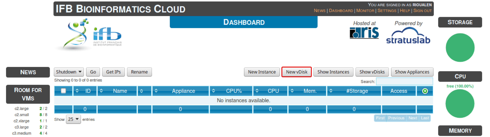

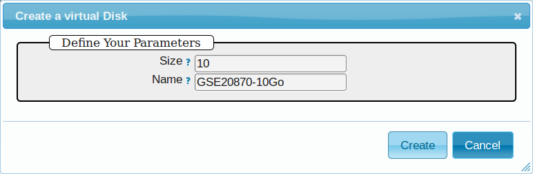

Creation of an instance
~~~~~~~~~~~~~~~~~~~~~~~~~~~~~~~~~~~~~~~~~~~~~~~~~~~~~~~~~~~~~~~~

Creating an *instance* consists in *instanciating* an existing *appliance*. 
It creates a virtual environment that has the same contents as the appliance chosen, 
and that is accessible through ssh from your local host. 

1. Click *New Instance* button.
2. Choose an appliance in the drop-down menu. You may use the filter
   menu in order to look for a specific tool.
3. Name your virtual machine.
4. Choose the amount of CPU and RAM to grant the VM.
5. Attach the vDisk.
6. Click *Run*.

**change screencap**

.. figure:: ../img/create_instance.png
   :alt: 

7. After a few seconds, you may refresh the page until the newly created
   instance shows up on the dashboard. Clicking on the ssh mention in
   the *Access* column will give you the commands to access your virtual
   machine.

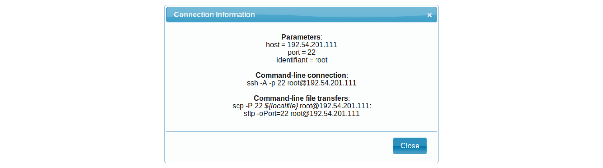

8. If the appliance has an HTTP interface, a link will also be provided
   in the *Access* column.
   
9. Connect to your VM by commandline.

::

    # Replace XXX by the IP of your instance
    ssh -A -p 22 root@192.54.201.XXX

Creation of an appliance
~~~~~~~~~~~~~~~~~~~~~~~~~~~~~~~~~~~~~~~~~~~~~~~~~~~~~~~~~~~~~~~~

Creating your own appliance can be as simple as instantiating an
existing one. You just need to chose a "base" to build it on. 

1. Click *New Instance* button.
2. Choose the appliance **Ubuntu 14.04 IFB (16-12)**.
3. Name your instance.
4. Check **Create appliance**.
5. Choose the amount of CPU and RAM to grant the VM.
6. Attach the vDisk.
7. Click *Run*.

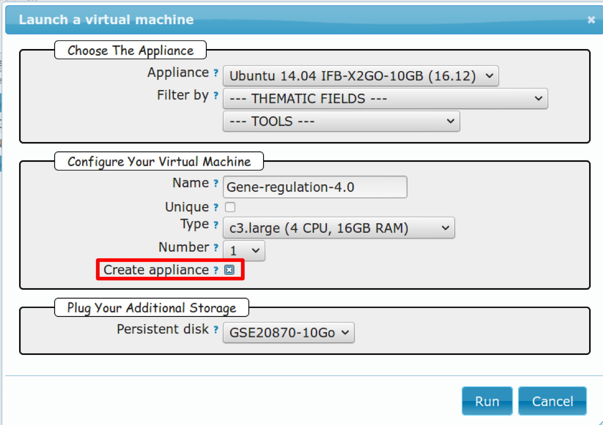

8. Refresh the page. Your appliance should appear in orange because of
   the creation mode you selected. You can now click on the **ssh**
   column to see the ssh parameters. It should look like this:

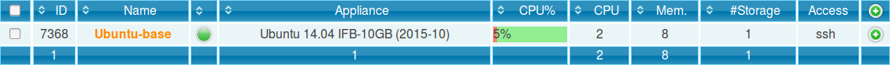

9. Connect to your VM by commandline.

   ::

       # Replace XXX by the IP of your instance
       ssh -A -p 22 root@192.54.201.XXX

Once you're connected to your appliance, you can install all the programs 
that you want. You can check out `this section <http://gene-regulation.readthedocs.io/en/latest/dependencies.html#>`__ for a manual on how to install NGS tools. 
Beware that the amount of disk space of the appliance itself 
is limited!

Later on, you can ask an admin from the IFB cloud to register the appliance, 
in order for it to become available to other cloud users. 

First connection to the instance
~~~~~~~~~~~~~~~~~~~~~~~~~~~~~~~~~~~~~~~~~~~~~~~~~~~~~~~~~~~~~~~~

Data management
****************************************************************

Virtual disk
^^^^^^^^^^^^^^^^^^^^^^^^^^^^^^^^^^^^^^^^^^^^^^^^^^^^^^^^^^^^^^^^

By default, if a vDisk has been attached to the VM, it is mounted under
``/root/mydisk``.

Transfers
^^^^^^^^^^^^^^^^^^^^^^^^^^^^^^^^^^^^^^^^^^^^^^^^^^^^^^^^^^^^^^^^

You can transfer data from your local computer to the VM using commands
provided under *Access* > ssh:

::

    # Replace XXX by the IP of your instance
    scp -P 22 ${localfile} root@192.54.201.XXX:
    sftp -oPort=22 root@192.54.201.XXX

Another way is to use rsync:

::

    # Replace XXX by the IP of your instance
    rsync -ruptvl ${localfile} root@192.54.201.XXX:/root/mydisk/

Software installation
****************************************************************

Once you're connected to the VM through ``ssh``, you can install any
program just the way you would do it locally (see tutorials in `this
directory <http://gene-regulation.readthedocs.io/en/latest/dependencies.html#>`__
for instance).

Configuration
****************************************************************

User account
^^^^^^^^^^^^^^^^^^^^^^^^^^^^^^^^^^^^^^^^^^^^^^^^^^^^^^^^^^^^^^^^

Create user account and grant it sudo privileges (followed procedure
`here <https://www.digitalocean.com/community/tutorials/how-to-add-and-delete-users-on-an-ubuntu-14-04-vps>`__).

Shell coloring
^^^^^^^^^^^^^^^^^^^^^^^^^^^^^^^^^^^^^^^^^^^^^^^^^^^^^^^^^^^^^^^^

::

    nano ~/.bashrc

Fetch following paragraph and uncomment command ``force-color``.

::

    # uncomment for a colored prompt, if the terminal has the capability; turned
    # off by default to not distract the user: the focus in a terminal window
    # should be on the output of commands, not on the prompt
    force_color_prompt=yes

::

    source ~/.bashrc


Using the Gene-regulation appliance
~~~~~~~~~~~~~~~~~~~~~~~~~~~~~~~~~~~~~~~~~~~~~~~~~~~~~~~~~~~~~~~~

Requirements
****************************************************************

**User account creation & configuration**

-  Using the IFB cloud facilities requires to have a user account.
   Register
   `here <https://cloud.france-bioinformatique.fr/accounts/register/>`__.

-  Once your account has been validated, you can
   `login <https://cloud.france-bioinformatique.fr/accounts/login/>`__.

-  In order to be able to access your instances through SSH, you should
   register your SSH public key in your `account
   settings <https://cloud.france-bioinformatique.fr/cloud/profile/>`__,
   through the dashboard.

Virtual disk creation
****************************************************************

Appliances usually have a limited amount of disk space (up to 10 or 20Go).
If the instance to be run necessitates disk space, you have to create a
virtual disk (vDisk) prior to launching it.

Check out `this section <http://gene-regulation.readthedocs.io/en/latest/environments.html#virtual-disk-creation>`__ 
for details.

1. Click *New vDisk* button.
2. Enter a size (whole number equating to the amount of Go needed).
3. Name it (e.g. ``GSE20870-10Gb``, the ID of the Gene Expression
   Omnibus series that will be stored on the virtual drive).


Creation of an instance
****************************************************************

1. Click *New Instance* button.
2. Choose appliance **Gene regulation 4.0** in the drop-down menu.
3. Name your VM.
4. Choose the amount of CPU and RAM to grant the VM.
5. Attach the vDisk.
6. Click *Run*.

7. After a few seconds, you may refresh the page until the newly created
   instance shows up on the dashboard. Clicking on the ssh mention in
   the *Access* column will give you the commands to access your virtual
   machine.

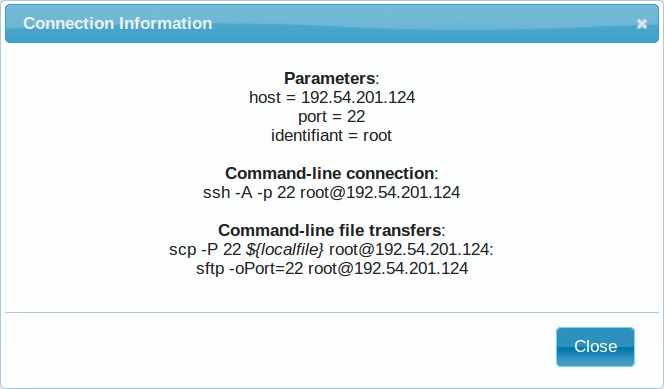

Connection to the device
****************************************************************

Open a terminal on your host computer and type in:

::

    # Replace XXX by the IP of your instance
    ssh -A -p 22 root@192.54.201.XXX

Download source data
****************************************************************

On the IFB cloud VM, the vDisk is automatically attached and mounted by
default under ``/root/mydisk``, or ``~/mydisk``.

Here we create a folder to store the source data files and the files 
that will results from the execution of our workflow. 

We also create a link to the gene-regulation library. 

::

    ANALYSIS_DIR=${HOME}/mydisk/ChIP-seq_SE_GSE20870
    mkdir -p ${ANALYSIS_DIR}
    cd ${ANALYSIS_DIR}
    ln -s ${HOME}/gene-regulation-4.0 gene-regulation

Download data
^^^^^^^^^^^^^^^^^^^^^^^^^^^^^^^^^^^^^^^^^^^^^^^^^^^^^^^^^^^^^^^^

The following commands will download the raw files from the `GEO database <https://www.ncbi.nlm.nih.gov/geo/>`__, 
and create the folders to organize them properly. 

::

    wget --no-clobber ftp://ftp-trace.ncbi.nlm.nih.gov/sra/sra-instant/reads/ByExp/sra/SRX%2FSRX021%2FSRX021358/SRR051929/SRR051929.sra -P ${ANALYSIS_DIR}/data/GSM521934
    wget --no-clobber ftp://ftp-trace.ncbi.nlm.nih.gov/sra/sra-instant/reads/ByExp/sra/SRX%2FSRX021%2FSRX021359/SRR051930/SRR051930.sra -P ${ANALYSIS_DIR}/data/GSM521935

Download reference genome & annotations
^^^^^^^^^^^^^^^^^^^^^^^^^^^^^^^^^^^^^^^^^^^^^^^^^^^^^^^^^^^^^^^^

The following commands will download the required genome files in a specific directory:
- fasta file of the reference genome;
- gff3 annotation file;
- gtf annotation file.

::

    wget -nc ftp://ftp.ensemblgenomes.org/pub/fungi/release-30/fasta/saccharomyces_cerevisiae/dna/Saccharomyces_cerevisiae.R64-1-1.30.dna.genome.fa.gz -P ${ANALYSIS_DIR}/genome
    wget -nc ftp://ftp.ensemblgenomes.org/pub/fungi/release-30/gff3/saccharomyces_cerevisiae/Saccharomyces_cerevisiae.R64-1-1.30.gff3.gz -P ${ANALYSIS_DIR}/genome
    wget -nc ftp://ftp.ensemblgenomes.org/pub/fungi/release-30/gtf/saccharomyces_cerevisiae/Saccharomyces_cerevisiae.R64-1-1.30.gtf.gz -P ${ANALYSIS_DIR}/genome
    gunzip ${ANALYSIS_DIR}/genome/*.gz

Your file organization should now look like this:

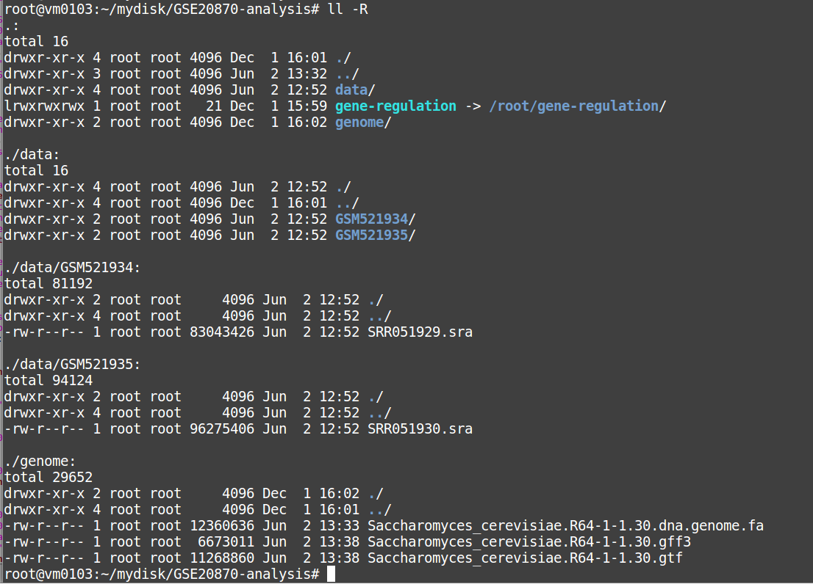

Run the workflow
****************************************************************

You can use the option ``-n`` to make a dry run.

::

    cd  ${ANALYSIS_DIR}
    snakemake -p -s gene-regulation/scripts/snakefiles/workflows/factor_workflow.py --configfile gene-regulation/examples/GSE20870/GSE20870.yml -n

::

    snakemake -p -s gene-regulation/scripts/snakefiles/workflows/factor_workflow.py --configfile gene-regulation/examples/GSE20870/GSE20870.yml

Using 4CPU & 8Go of RAM, the workflow took about 12mn to complete.

Congratulations! You just executed this wonderful workflow:

.. figure:: ../img/rule.png
   :alt: 

Visualizing results
****************************************************************

Install and run the X2Go client on your host computer
^^^^^^^^^^^^^^^^^^^^^^^^^^^^^^^^^^^^^^^^^^^^^^^^^^^^^^^^^^^^^^^^

The Virtual Machine created on the IFB cloud doesn't have a graphical
interface, but it contains the X2GO software. We're gonna use it to
create a distant desktop to visualize the results from the host machine.

1. Install the x2go client and launch it from your local computer.

::

    sudo apt-get install x2goclient
    x2goclient

.. raw:: html

   <!--2. Copy your ssh key to the authorized keys of the virtual machine. (**à revoir !!**)

   ```
   cat $HOME/.ssh/id_rsa.pub | ssh root@192.54.201.XXX "cat >> .ssh/authorized_keys"
   ```
   -->

2. Create a new session using the Mate desktop.

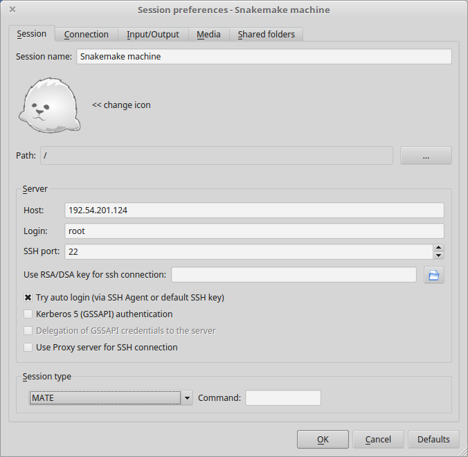

3. The session now appears on the right panel. Just click it to lauch
   it!

.. figure:: ../img/x2go_launch_session.png
   :alt: 

4. You should be now on the virtual desktop!

.. figure:: ../img/mate_term.png
   :alt: 

Note: you may need to change your keyboard settings

-  Go to **System** > **Preferences** > **Keybords**
-  Click on tab **Layouts**
-  Add and/or remove desired keyboards

Visualize results
^^^^^^^^^^^^^^^^^^^^^^^^^^^^^^^^^^^^^^^^^^^^^^^^^^^^^^^^^^^^^^^^

The result files should be organized like this:

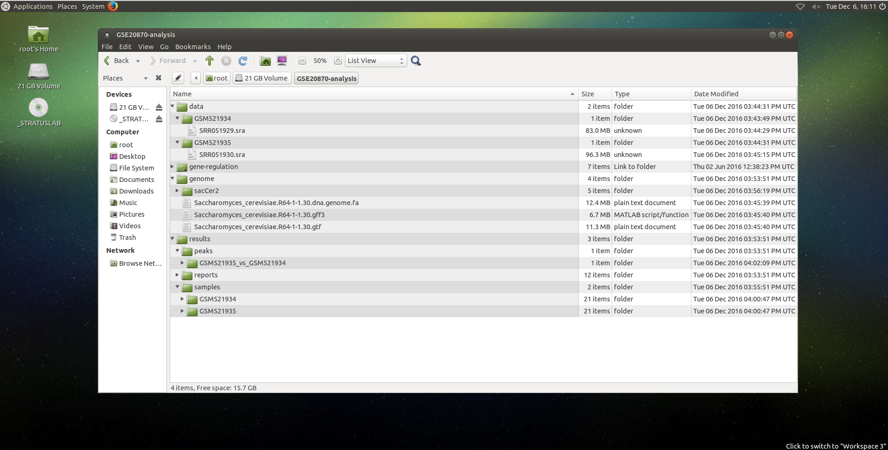

**FastQC**


You can visualize the FastQC results using firefox or any other
navigator. Fetch the ``html`` files located in the sample directories.

-  Before trimming:

   ::

       firefox /root/mydisk/ChIP-seq_SE_GSE20870/fastq/GSM521934/GSM521934_fastqc/GSM521934_fastqc.html
       firefox /root/mydisk/ChIP-seq_SE_GSE20870/fastq/GSM521935/GSM521935_fastqc/GSM521935_fastqc.html

-  After trimming:

   ::

       firefox /root/mydisk/ChIP-seq_SE_GSE20870/fastq/GSM521934/GSM521934_sickle-se-q20_fastqc/GSM521934_sickle-se-q20_fastqc.html
       firefox /root/mydisk/ChIP-seq_SE_GSE20870/fastq/GSM521935/GSM521935_sickle-se-q20_fastqc/GSM521935_sickle-se-q20_fastqc.html

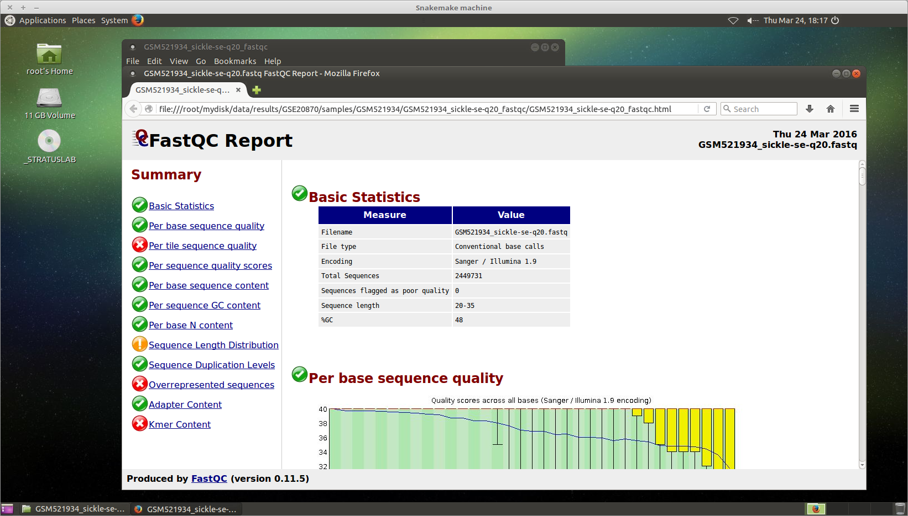

**IGV**

You can visualize the peaks by running IGV from the terminal.

.. raw:: html

   <!--You may need to source the `~/.bashrc` first in order to update the `$PATH`. 
   ```
   source ~/.bashrc
   -->

::

    igv

-  Click "File" > "Open session..." and chose the file
   ``/root/mydisk/ChIP-seq_SE_GSE20870/reports/peaks/igv_session.xml``.
-  You may need to adjust the panel sizes.

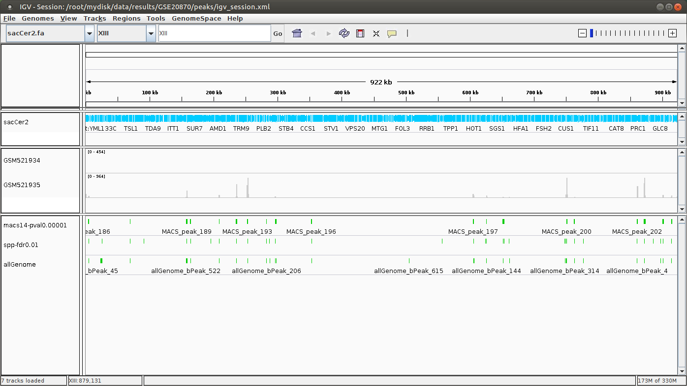

Create your own Gene-regulation appliance
~~~~~~~~~~~~~~~~~~~~~~~~~~~~~~~~~~~~~~~~~~~~~~~~~~~~~~~~~~~~~~~~

Creating a new appliance from scratch is very similar to using one. You
have to satisfy the requirements described `here <http://gene-regulation.readthedocs.io/en/latest/environments.html#ifb-cloud-utilities>`__.

If you want to manipulate data, you should also create a vDisk following `these instructions <http://gene-regulation.readthedocs.io/en/latest/environments.html#virtual-disk-creation>`__.

Creation of an *appliance*
****************************************************************

When creating a new instance, choose a 10Go Ubuntu appliance and check
the **Create appliance** option:

1. Click **New Instance** button.
2. Choose appliance **Ubuntu 14.04 IFB-X2GO-10GB** in the drop-down
   menu.
3. Name your VM.
4. Choose the amount of CPU and RAM to grant the VM.
5. Check the box **Create appliance**.
6. Attach the vDisk.
7. Click **Run**.


The new instance should appear in orange bold fonts in the dashboard.


You can connect to the instance through ``ssh`` as shown in previous sections.

Installing programs and dependencies
****************************************************************

Once in the virtual machine, you can install the required programs.

Get the ``gene-regulation`` repository
****************************************************************

::

    wget -nc https://github.com/rioualen/gene-regulation/archive/4.0.tar.gz
    tar zvxf 4.0.tar.gz

Run makefile to install the dependencies
****************************************************************

The Gene-regulation library contains a makefile that installs most of the dependencies required to execute the snakemake workflows. 
You can also install tools manually, following `these instructions <http://gene-regulation.readthedocs.io/en/latest/dependencies.html#manual-installation>`__. 

The execution of the makefile may take a while (up to 30mn-1h), mostly because of the python libraries that are necessary to several NGS tools. 

Then you should source the ``.bashrc`` in order to update the ``$PATH`` accordingly.

::

    make -f gene-regulation-4.0/scripts/makefiles/install_tools_and_libs.mk all
    source ~/.bashrc

If you want to install the x2go server on the VM for visualization purposes, as shown `here <http://gene-regulation.readthedocs.io/en/latest/environments.html#visualizing-results>`__, 
you can also execute this rule:

::

    make -f gene-regulation-4.0/scripts/makefiles/install_tools_and_libs.mk desktop_and_x2go

You should now be able to execute the example workflow by following instructions from `here <http://gene-regulation.readthedocs.io/en/latest/environments.html#download-source-data>`__. 

In order for your appliance to remain persistant and be available to
other users on the IFB cloud, you should contact an admin. 


Docker
----------------------------------------------------------------


Get started with Docker!
~~~~~~~~~~~~~~~~~~~~~~~~~~~~~~~~~~~~~~~~~~~~~~~~~~~~~~~~~~~~~~~~

Create a Docker account
****************************************************************

Instructions `here <https://docs.docker.com/linux/step_five/>`__.

Install Docker on your local host
****************************************************************

Instructions for a linux install can be found
`here <https://docs.docker.com/linux/>`__, along with mac and windows
instructions. A useful script is availalable
`here <https://gist.github.com/bhgraham/ed9f8242dc610b1f38e5>`__ for a
debian install.

You can also install it on Ubuntu 14.04 (64bits) typing the following:

::

    #sudo apt-get update
    sudo apt-get -y install docker.io
    sudo usermod -aG docker <username>

You should now log out and in again from your Ubuntu session. This short
procedure was tested in a virtual machine under VirtualBox (see
corresponding tutorial).

.. raw:: html

   <!--sudo service docker start-->

You can test whether docker works properly:

::

    docker run hello-world

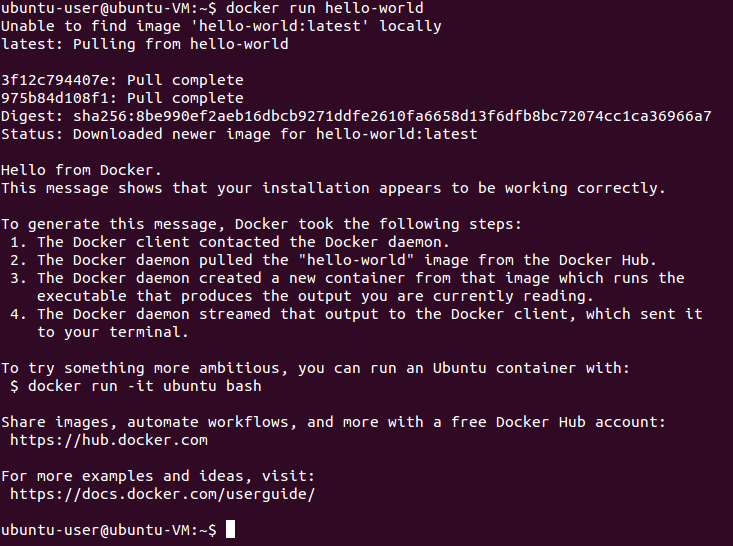

NB: it seems qwerty keyboard keeps popping up after docker install.
Switch back to azerty:

::

    setxkbmap fr

<!-- Run the following command:

::

    sudo apt-get --yes install docker

-->

Create shared repositories and download source data
****************************************************************

In order to execute the study case GSE20870, you should enter the
following commands:

::

    export ANALYSIS_DIR=~/ChIP-seq_SE_GSE20870
    mkdir $ANALYSIS_DIR
    cd $ANALYSIS_DIR

::

    mkdir data/GSM521934 
    wget -nc ftp://ftp-trace.ncbi.nlm.nih.gov/sra/sra-instant/reads/ByExp/sra/SRX%2FSRX021%2FSRX021358/SRR051929/SRR051929.sra -P data/GSM521934

    mkdir data/GSM521935
    wget -nc ftp://ftp-trace.ncbi.nlm.nih.gov/sra/sra-instant/reads/ByExp/sra/SRX%2FSRX021%2FSRX021359/SRR051930/SRR051930.sra -P data/GSM521935

Fetch the Docker image and run it with shared folders
****************************************************************

::

    docker pull rioualen/gene-regulation:2.0
    docker run -v $ANALYSIS_DIR:~/ChIP-seq_SE_GSE20870 -it rioualen/gene-regulation:2.0 /bin/bash

You can share as many folders as desired, using this syntax:
``-v /path/on/host/:/path/on/docker/``.

Execute the pipeline
****************************************************************

::

    snakemake -p -s gene-regulation/scripts/snakefiles/workflows/factor_workflow.py --configfile gene-regulation/examples/GSE20870/GSE20870.yml

<!-- # JVH / Mac

Quick tour
****************************************************************

On Mac OSX

1. Install docker

::

        https://docs.docker.com/engine/installation/mac/

2. Open the application Docker Quickstart Terminal. This open a new terminal window and launches the docker daemon.


3. Get the gene-regulation docker


docker pull rioualen/gene-regulation:0.3

4. Check the list of docker images available locally


docker images

5. Start the gene-regulation image. The option ``-it`` specifies the interactive mode, which is necessary to be able using this VM


::

    docker run -it rioualen/gene-regulation:0.3 /bin/bash

You are now in a bash session of a gene-regulation docker. In this
session, you are "root" user, i;e. you have all the administration
rights. You can check this easily:

::

    whoami

6. Check the disks available on this docker


::

    df -h

Currently, your docker can only access its local disk, which comes with
the VM. **Beware**: any data stored on this local disk will be lost when
you shut down the gene-regulation docker.

7. Exit and get back to your gene-regulation container


If you exits your shell session, the docker will still be running.

::

    exit

You are now back to the host terminal.

Check the currently active docker containers (processes).

::

    docker ps -a

Note that you can run several containers of the same image. Each active
container has a unique identifier which appears in the first column when
you run ``docker ps`` (e.g. ``faff5298ef95``). You can re-open a running
container with the command

::

    docker attach [CONTAINER_ID]

where ``[CONTAINER_IDR]`` must be replaced by the actual ID of the
running docker container (e.g. ``faff5298ef95``).

8. Shutting down the container


We will now shut down this image, and start a new one which will enable
you to store persistent data.

::

    docker stop [CONTAINER_ID]

9. Starting a docker container with a shared folder.


500 docker pull rioualen/gene-regulation:0.3 501 mkdir -p
~/gene-regulation\_data/GSE20870/GSM521934
~/gene-regulation\_data/GSE20870/GSM521935 502 cd
~/gene-regulation\_data/GSE20870/GSM521934 503 wget
ftp://ftp-trace.ncbi.nlm.nih.gov/sra/sra-instant/reads/ByExp/sra/SRX%2FSRX021%2FSRX021358/SRR051929/SRR051929.sra
504 cd ~/gene-regulation\_data/GSE20870/GSM521935 505 wget
ftp://ftp-trace.ncbi.nlm.nih.gov/sra/sra-instant/reads/ByExp/sra/SRX%2FSRX021%2FSRX021359/SRR051930/SRR051930.sra
506 mkdir ~/gene-regulation\_data/results/GSE20870 507 mkdir -p
~/gene-regulation\_data/results/GSE20870 508 docker pull
rioualen/gene-regulation:0.3 509 docker run -v
~/gene-regulation\_data:/data -it rioualen/gene-regulation:0.3 /bin/bash

10. Running the snakemake demo workflow on the docker container


::

    ls /data
    ls /data/GSE20870/
    ls /data/GSE20870/GSM521934/
    exit
    ls /data
    source ~/bin/ngs_bashrc
    snakemake -s scripts/snakefiles/workflows/factor_workflow.py -np
    history
    snakemake -s scripts/snakefiles/workflows/factor_workflow.py -np


Questions
****************************************************************

1. Quand on fait un login dans la vm gene--regulation, on entre dans un
   shell basique (pas bash). Est-il possible de configurer docker pour
   qu'on entre automatiquement en bash ?

Entry point /bin/bash

2. Il faut ajouter le bashrc dans le /etc du docker.


VirtualBox
----------------------------------------------------------------

Creating a virtual machine (VM)
~~~~~~~~~~~~~~~~~~~~~~~~~~~~~~~~~~~~~~~~~~~~~~~~~~~~~~~~~~~~~~~~

Creating a VM under VirtualBox software
****************************************************************

Requirements
^^^^^^^^^^^^^^^^^^^^^^^^^^^^^^^^^^^^^^^^^^^^^^^^^^^^^^^^^^^^^^^^

**Virtualbox software**

We used VirtualBox 5.0.2, downloadable from https://www.virtualbox.org/
or to be installed manually:

::

    sudo apt-get install virtualbox-5.0

VirtualBox extension pack can be requested (eg. for handling USB2.0, see
'errors' section).

::

    wget http://download.virtualbox.org/virtualbox/5.0.2/Oracle_VM_VirtualBox_Extension_Pack-5.0.2.vbox-extpack

**Ubuntu image**

In this tutorial we used Ubuntu 14.04.5, latest long-term supported
version.

::

    wget http://releases.ubuntu.com/14.04/ubuntu-14.04.5-desktop-amd64.iso


Virtual Box configuration
^^^^^^^^^^^^^^^^^^^^^^^^^^^^^^^^^^^^^^^^^^^^^^^^^^^^^^^^^^^^^^^^

Before configuring the virtual machine, we need to tell VirtualBox how
it will enable your local virtual machines to interact with their host
(the operating system of the machine on which the VM is running).

1. Open *VirtualBox > File > Preferences...*

2. Open the tab *Network* > *Host-only Networks*

   -  click on the "+" icon
   -  this creates a network vboxnet0. Select this network, click on the
      screw driver icon (*edit host-only network*), and set the
      following options:

   -  *Adapter* tab

      -  IPv4 Address: 192.168.56.1
      -  IPv4 Network Mask: 255.255.255.0
      -  IPv6 Adress: blank
      -  IPv6 Network Mask Length: 0

   -  *DHCP Server* tab

      -  Check *Enable Server*
      -  *Server Address:* 192.168.56.100
      -  *Server Mask:* 255.255.255.0
      -  *Lower Address Bound:* 192.168.56.101
      -  *Upper Address Bound:* 192.168.56.254

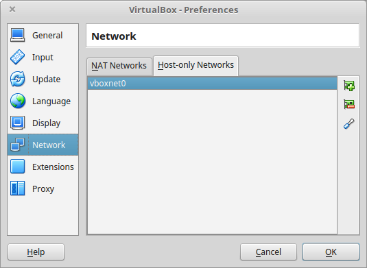

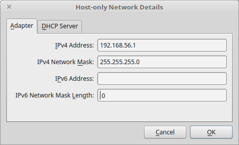

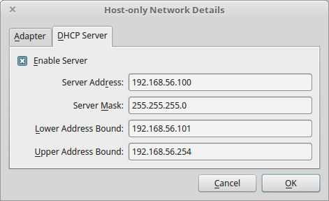

Creation of the virtual machine
^^^^^^^^^^^^^^^^^^^^^^^^^^^^^^^^

1. Open VirtualBox

2. Click on the **New** button.

3. Parameters

-  Name and operating system

   -  Name: gene-regulation
   -  Type: Linux
   -  Version: Ubuntu (64 bits)

-  Memory size: 2048 Mb (this can be modified afterwards).

-  Hard drive: *Create a virtual hard drive now*.

-  Hard drive file type: *VDI* (VirtualBox Disk Image).

-  Storage on physical hard drive

   -  Select *Dynamically allocated*

-  File location and size

   -  max size of virtual hard drive: 30GB
   -  click on **Create** button

*Note:* you should adapt the virtual hard drive size to your needs. Be
aware that it's difficult to extend later on, so you should aim larger
than expected. Since the size is dynamically allocated, it won't take up
too much space until you fill it.

At this stage, the VM has been created and needs to be configured before
installing the operating system.

VM configuration
^^^^^^^^^^^^^^^^^

In the VirtualBox main window, select the newly created virtual machine,
and click on the **Settings** button.

**General**

For the desktop version of Ubuntu, it is convenient to enable copy-paste
between the guest and the host.

-  Select the tab *Advanced*
-  Set *Shared clipboard* to *Bidirectional*
-  Set *Drag'n Drop* to *Bidirectional*

**Storage**

Click on the **Empty** disc icon in the storage tree. Select the disc
icon on the right and fetch the downloaded ``.iso`` image (see
**Requirements**). Click on *OK*.

**Network**

VirtualBox offers many alternative ways to configure network
communications between the virtual machine, the host machine, and the
external network.

To get more information about network settings:

-  VirtualBox `manual
   page <https://www.virtualbox.org/manual/ch06.html>`__
-  An excellent
   `tutorial <http://christophermaier.name/blog/2010/09/01/host-only-networking-with-virtualbox>`__

We present here one possible way to configure your Virtual machine, but
this should be adapted to the particular security/flexibility
requirements of the network where the maching has to run.

In the VM settings, select tne *Network* tab. VirtualBox enables you to
specify several adapters, each corresponding to one separate network
access (e.g. using an ethernet card + wi-fi connection).

-  click on the tab *Adapter 1*,

   -  check *Enable Network Adapter*
   -  Attached to: *Host-only Adapter*
   -  Name: *vboxnet0* (this network must have been created beforehand,
      see above)

-  click on the tab *Adapter 2*,

   -  check *Enable Network Adapter*
   -  Attached to : *NAT*

-  click on the tab *Adapter 3*,

   -  check *Enable Network Adapter*
   -  Attached to : *Bridged Adapter*
   -  Name: choose an option corresponding to the actual internet
      connection of the host machine (e.g. ethernet cable, Wi-Fi, ...).

**You can now start the VM.**

Operating system installation
^^^^^^^^^^^^^^^^^^^^^^^^^^^^^^^

-  Welcome

   -  check the language settings and click on *Install Ubuntu*.

-  Preparing to install Ubuntu

   -  leave all default parameters and click *Continue*.

-  Installation type

   -  (leave the default) Erase disk and install Ubuntu, click *Install
      Now*.

-  Where are you (automatic)

   -  Paris

-  Keyboard layout

   -  French - French

-  Who are you ?

   -  Your name: gene-regulation
   -  Your computer's name: gene-regulation-virtual
   -  Pick a username: gr
   -  Choose a password: genereg
   -  (Activate the option Log in automatically)

Restart once installation is completed.

..Once on the desktop, go to the VM menu: select *Devices* then *Install
Guest Additions CD image*. Run it.

..The VirtualBox Guest Additions will provide closer integration between
host and guest and improve the interactive performance of guest systems.
Reboot again to see the new display.

Installing programs and dependencies
~~~~~~~~~~~~~~~~~~~~~~~~~~~~~~~~~~~~~~~~~~~~~~~~~~~~~~~~~~~~~~~~

Once in the virtual machine, you can install the required programs from
a terminal.

Get the ``gene-regulation`` repository
****************************************************************

::

    cd
    wget --no-clobber https://github.com/rioualen/gene-regulation/archive/4.0.tar.gz 
    tar zvxf 4.0.tar.gz

..    cd
..    git clone https://github.com/rioualen/gene-regulation.git

Run makefile to install all required dependencies
****************************************************************

This may take a while (30mn to 1h) & source the ``.bashrc`` (it's been
updated with the ``$PATH`` for newly installed applications).

::

    cd
    ln -s gene-regulation-4.0 gene-regulation
    make -f gene-regulation/scripts/makefiles/install_tools_and_libs.mk all
    source ~/.bashrc

Executing snakemake workflow example
~~~~~~~~~~~~~~~~~~~~~~~~~~~~~~~~~~~~~~~~~~~~~~~~~~~~~~~~~~~~~~~~

::

    ## Create a base directory for the analysis

    export ANALYSIS_DIR="${HOME}/ChIP-seq_SE_GSM20870"
    mkdir ${ANALYSIS_DIR}

::

    ## Download source data

    mkdir -p ${ANALYSIS_DIR}/data/GSM521934 ${ANALYSIS_DIR}/data/GSM521935
    wget --no-clobber ftp://ftp-trace.ncbi.nlm.nih.gov/sra/sra-instant/reads/ByExp/sra/SRX%2FSRX021%2FSRX021358/SRR051929/SRR051929.sra -P ${ANALYSIS_DIR}/data/GSM521934
    wget --no-clobber ftp://ftp-trace.ncbi.nlm.nih.gov/sra/sra-instant/reads/ByExp/sra/SRX%2FSRX021%2FSRX021359/SRR051930/SRR051930.sra -P ${ANALYSIS_DIR}/data/GSM521935

::

    ## Download reference genome & annotations

    wget -nc ftp://ftp.ensemblgenomes.org/pub/fungi/release-30/fasta/saccharomyces_cerevisiae/dna/Saccharomyces_cerevisiae.R64-1-1.30.dna.genome.fa.gz -P ${ANALYSIS_DIR}/genome
    wget -nc ftp://ftp.ensemblgenomes.org/pub/fungi/release-30/gff3/saccharomyces_cerevisiae/Saccharomyces_cerevisiae.R64-1-1.30.gff3.gz -P ${ANALYSIS_DIR}/genome
    wget -nc ftp://ftp.ensemblgenomes.org/pub/fungi/release-30/gtf/saccharomyces_cerevisiae/Saccharomyces_cerevisiae.R64-1-1.30.gtf.gz -P ${ANALYSIS_DIR}/genome
    gunzip ${ANALYSIS_DIR}/genome/*.gz

::

    ## Execute workflow

    cd ${ANALYSIS_DIR}
    ln -s  ${HOME}/gene-regulation
    snakemake -p --configfile gene-regulation/examples/ChIP-seq_SE_GSE20870/config.yml -s gene-regulation/scripts/snakefiles/workflows/import_from_sra.wf
    snakemake -p --configfile gene-regulation/examples/ChIP-seq_SE_GSE20870/config.yml -s gene-regulation/scripts/snakefiles/workflows/quality_control.wf
    snakemake -p --configfile gene-regulation/examples/ChIP-seq_SE_GSE20870/config.yml -s gene-regulation/scripts/snakefiles/workflows/ChIP-seq.wf

Congratulations! You just executed these wonderful workflows:

.. figure:: ../img/import_to_fastq_rulegraph.png
   :alt: 

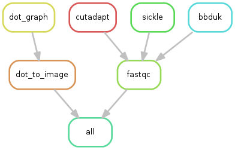

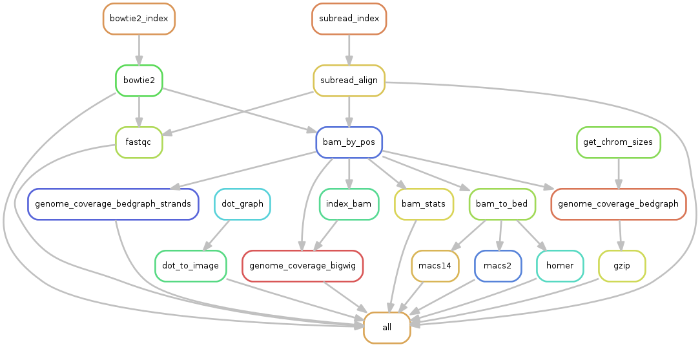

Visualizing results
~~~~~~~~~~~~~~~~~~~~~~~~~~~~~~~~~~~~~~~~~~~~~~~~~~~~~~~~~~~~~~~~

FastQC
****************************************************************

You can visualize the FastQC results using firefox or any other
navigator. Fetch the ``html`` files located in the sample directories.

-  Before trimming:

   ::

       firefox ~/ChIP-seq_SE_GSE20870/fastq/GSM521934/GSM521934_fastqc/GSM521934_fastqc.html
       firefox ~/ChIP-seq_SE_GSE20870/fastq/GSM521935/GSM521935_fastqc/GSM521935_fastqc.html

-  After trimming:

   ::

       firefox ~/ChIP-seq_SE_GSE20870/fastq/GSM521934/GSM521934_sickle-se-q20_fastqc/GSM521934_sickle-se-q20_fastqc.html
       firefox ~/ChIP-seq_SE_GSE20870/fastq/GSM521935/GSM521935_sickle-se-q20_fastqc/GSM521935_sickle-se-q20_fastqc.html

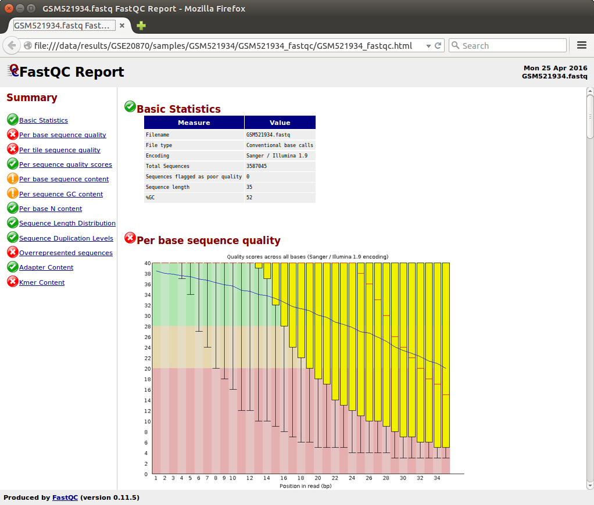

IGV
****************************************************************

You can visualize the peaks by running IGV from the terminal.

::

    igv

-  Click "File" > "Open session..." and chose the file
   ``~/ChIP-seq_SE_GSE20870/results/peaks/igv_session.xml``.
-  You may need to adjust the panel sizes.


Export appliance (todo)
~~~~~~~~~~~~~~~~~~~~~~~~~~~~~~~~~~~~~~~~~~~~~~~~~~~~~~~~~~~~~~~~

The virtual machine created with VirtualBox can be exported and saved as
an appliance.

-  Shut down the VM.
-  In VirtualBox, open *File* -> *Export Appliance ...*

-  Select the VM ``gene-regulation``
-  *Next >*

-  Save as: gene-regulation-[YYMMDD].ova
-  Format: OVF 1.0
-  Write Manifest File: check
-  *Next >*

-  Appliance Settings

   -  Name: gene-regulation-[YYMMDD]
   -  Product: Regulatory Genomics Pipeline
   -  Product-URL: -
   -  Vendor: Claire Rioualen, Jacques van Helden
   -  Version: YYYY-MM-DD
   -  Description: Regulatory Genomics Pipeline using Snakemake,
      installed on an Ubuntu 14.04 Virtual Machine.
   -  License: Free of use for academic users, non-commercial and
      non-military usage.

-  *Export*

The appliance saved can be re-imported later on, on another computer if
needed.

Import appliance (todo)
~~~~~~~~~~~~~~~~~~~~~~~~~~~~~~~~~~~~~~~~~~~~~~~~~~~~~~~~~~~~~~~~

In VirtualBox, click menu File > Import appliance > fetch OVA file.

Note: there is apparently a bug with the export of VMs under VirtualBox
5.0. If you get this error when launching the imported file:

    A new node couldn't be inserted because one with the same name
    exists. (VERR\_CFGM\_NODE\_EXISTS).

There is a workaround: go to the imported VM settings, to the USB tab,
and untick "enable USB Controller". You should now be able to start the
VM.


Conda
----------------------------------------------------------------

*TODO*
