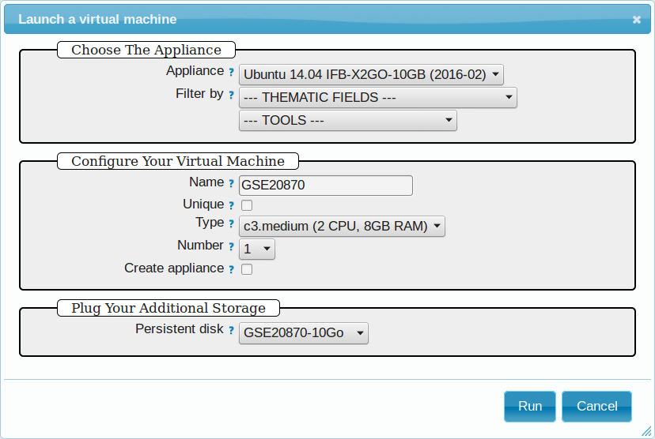
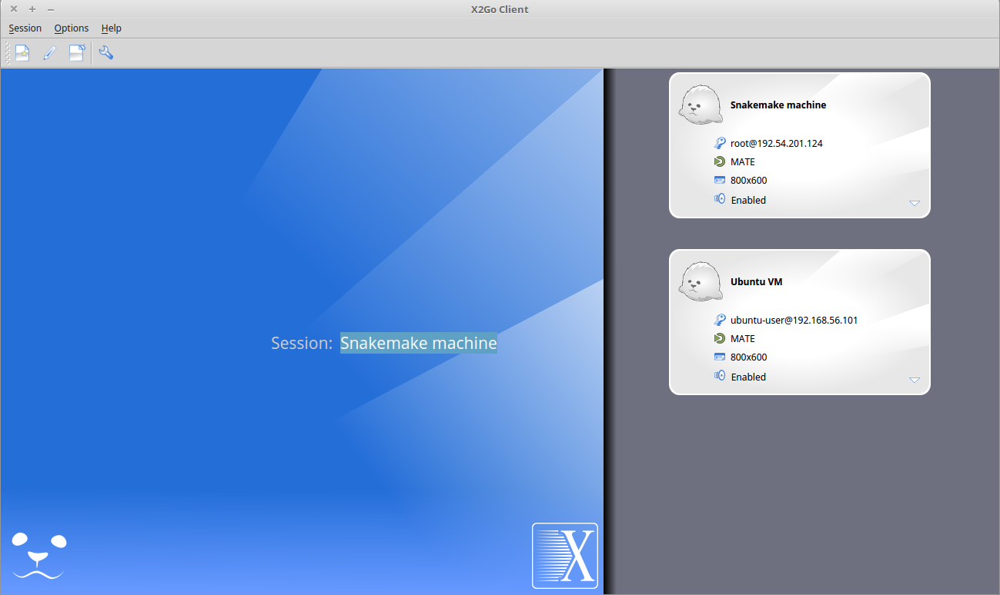
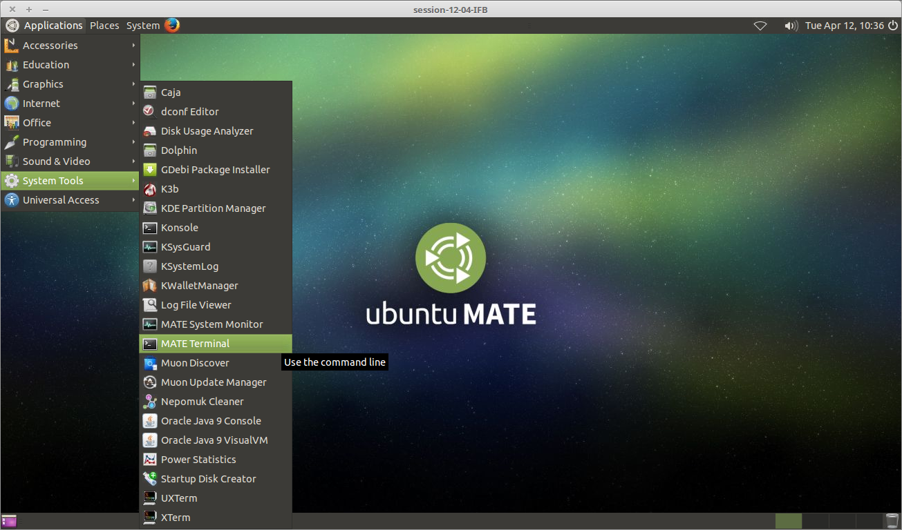

  * [1. Creating a virtual machine (VM)](#creating-a-virtual-machine-vm)
    * [1.1 Creating a VM on the IFB cloud](#creating-a-vm-on-the-ifb-cloud)
        * [Requirements](#requirements)
        * [Virtual disk creation](#virtual-disk-creation)
        * [Creation of an instance](#creation-of-an-instance)
        * [Connection to the device](#connection-to-the-device)
    * [1.2 Creating a VM under VirtualBox software](#creating-a-vm-under-virtualbox-software)
        * [Requirements](#requirements-1)
        * [Virtual Box configuration](#virtual-box-configuration)
        * [Creation of the virtual machine](#creation-of-the-virtual-machine)
        * [VM configuration](#vm-configuration)
        * [Operating system installation](#operating-system-installation)
  * [2. Installing programs and dependencies](#installing-programs-and-dependencies)
    * [2.1 Clone the gene-regulation repository](#clone-the-gene-regulation-repository)
    * [2.2 Run makefile to install all required dependencies](#run-makefile-to-install-all-required-dependencies)
  * [3. Executing snakemake workflows](#executing-snakemake-workflows)
    * [3.1 Download source data](#download-source-data)
        * [Virtual Box VM](#virtual-box)
        * [IFB cloud VM](#ifb-cloud)
    * [3.2 Execute workflow](#execute-workflow)
  * [4. Visualizing results](#visualizing-results)
    * [4.1 Installing and running the X2Go client (IFB VM)](#installing-and-running-the-x2go-client-ifb-cloud)
    * [4.2 Visualize results](#visualize-results)
        * [FastQC](#fastqc)
        * [IGV](#igv)
  * [5. Export appliance (VBox VM)](#export-appliance-vbox-vm)


> Note: this protocol was developed on a Unix computer, with the OS LMDE. The virtual machines are developed with the Ubuntu 14.04 OS. 

# Creating a virtual machine (VM)

## Creating a VM on the IFB cloud

### Requirements

**User account creation & configuration**

* Using the IFB cloud facilities requires to have a user account. Register [here](https://cloud.france-bioinformatique.fr/accounts/register/). 

* Once your account has been validated, you can [login](https://cloud.france-bioinformatique.fr/accounts/login/).

* In order to be able to access your instances through SSH, you should register your SSH public key in your [account settings](https://cloud.france-bioinformatique.fr/cloud/profile/), through the dashboard.

### Virtual disk creation

Appliances usually have a limited amount of disk space (up to 10, 20Go). If the instance to be run necessitates disk space, you have to create a virtual disk (vDisk) prior to launching it. By default, the capacity of storage granted to a user is 250Go, which can be divided into as many vDisks as necessary. When instantiating an appliance, you can chose to attach one of these vDIsks to the virtual machine. You'll be able to access data on this disk through SSH. 

1. Click *New vDisk* button.
2. Enter a size (whole number equating to the amount of Go needed). 
3. Name it.


<!--\includegraphics[width=250pt]{img/vdisk-x2go.png}-->


### Creation of an instance

1. Click *New Instance* button.
2. Choose appliance "Ubuntu 14.04 IFB-X2GO-10GB" in the drop-down menu. 
3. Name your VM.
4. Choose the amount of CPU and RAM to grant the VM (up to 8 CPU, 32 GB RAM).
5. Attach the vDisk.
6. Click *Run*.



7. After a few seconds, you may refresh the page until the newly created instance shows up on the dashboard. Clicking on the ssh mention in the *Access* column will give you the commands to access your virtual machine. 


### Connection to the device

1. Type the command in a terminal.

```
ssh -A -p 22 root@192.54.201.124
```

## Creating a VM under VirtualBox software

### Requirements

**Virtualbox software**

We used VirtualBox 5.0.2, downloadable from [https://www.virtualbox.org/](https://www.virtualbox.org/) or to be installed manually:
```
sudo apt-get install virtualbox-5.0
```
VirtualBox extension pack can be requested (eg. for handling USB2.0, see 'errors' section).
```
wget http://download.virtualbox.org/virtualbox/5.0.2/Oracle_VM_VirtualBox_Extension_Pack-5.0.2.vbox-extpack
```

**Ubuntu image**

In this tutorial we used Ubuntu 14.04.3, latest long-term supported version.
```
wget http://releases.ubuntu.com/14.04/ubuntu-14.04.3-desktop-amd64.iso
```
------------------------------------------

### Virtual Box configuration

Before configuring the virtual machine, we need to tell VirtualBox how it will enable your local virtual machines to interact with their host (the operating system of the machine on which the VM is running).

1. Open *VirtualBox > File > Preferences...*

2. Open the tab *Network* > *Host-only Networks*
     - click on the "+" icon
     - this creates a network vboxnet0. Select this network, click on the screw driver icon (*edit host-only network*), and set the following options:

      - *Adapter* tab
          - IPv4 Address: 192.168.56.1
          - IPv4 Network Mask: 255.255.255.0
          - IPv6 Adress: blank
          - IPv6 Network Mask Length: 0

      - *DHCP Server* tab
          - Check *Enable Server*
          - *Server Address:* 192.168.56.100
          - *Server Mask:* 255.255.255.0
          - *Lower Address Bound:* 192.168.56.101
          - *Upper Address Bound:* 192.168.56.254
          
### Creation of the virtual machine

1. Open VirtualBox

2. Click on the **New** button. 

3. Parameters

- Name and operating system

    - Name: gene-regulation
    - Type: Linux
    - Version: Ubuntu (64 bits)
    
- Memory size:	2048 Mb (this can be modified afterwards). 

- Hard drive:	*Create a virtual hard drive now*. 

- Hard drive file type: *VDI* (VirtualBox Disk Image).


<!--
- Hard drive file type: *VMDK* (Virtual Machine Disk). 

    I chose this option because it ensures a wider compatibility with other OS and Virtual Machine management systems. 

	   Another potential advantage of VMDK is that it enables to split virtualdisks in files <=2Gb, which is convenient to store them on FAT partitions. 
-->

- Storage on physical hard drive
    - Select *Dynamically allocated*
    
<!--
    - Activate the option *Split into files less than 2Gb*, which allows to store the VM on FAT partitions for Windows host machines.
-->

- File location and size
    - max size of virtual hard drive:	    30GB
    - click on **Create** button

*Note:* you should adapt the virtual hard drive size to your needs. Be aware that it's difficult to extend later on, so you should aim larger than expected. Since the size is dynamically allocated, it won't take up too much space until you fill it. 
<!--
        Beware: the size has to be larger than you real needs, because Ubuntu will automatically create some big  partitions (/dev and /run/shm). Since we allow dynamical memory allocation, it is fine to set the max size to 18Gb, which will be grossly assigned as follows:

        - max 14Gb for the root partition /
        - 2Gb for /dev
	      - 2Gb for /run/user
-->


At this stage, the VM has been created and needs to be configured before installing the operating system. 


### VM configuration

In the VirtualBox main window, select the newly created virtual machine, and click on the **Settings** button. 

**General**

For the desktop version of Ubuntu, it is convenient to enable copy-paste between the guest and the host.

- Select the tab *Advanced*
- Set *Shared clipboard* to *Bidirectional*

**Storage**

Click on the **Empty** disc icon in the storage tree. Select the disc icon on the right and fetch the downloaded `.iso` image(see **Requirements**).
Click on *OK*.


**Network**

VirtualBox offers many alternative ways to configure network communications between the virtual machine, the host machine, and the external network. 

To get more information about network settings: 

* VirtualBox manual page: [https://www.virtualbox.org/manual/ch06.html](https://www.virtualbox.org/manual/ch06.html)
* An excellent tutorial: [http://christophermaier.name/blog/2010/09/01/host-only-networking-with-virtualbox](http://christophermaier.name/blog/2010/09/01/host-only-networking-with-virtualbox)

We present here one possible way to configure your Virtual machine, but this should be adapted to the particular security/flexibility requirements of the network where the maching has to run. 


In the VM settings, select tne *Network* tab. VirtualBox enables you to specify several adapters, each corresponding to one separate network access (e.g. using an ethernet card + wi-fi connection).

- click on the tab *Adapter 1*,
    - check *Enable Network Adapter*
    - Attached to: *Host-only Adapter*
    - Name: *vboxnet0* (this network must have been created beforehand, see section 1.2.3)


- click on the tab *Adapter 2*,
    - check *Enable Network Adapter*
    - Attached to : *NAT*

- click on the tab *Adapter 3*,
    - check *Enable Network Adapter*
    - Attached to : *Bridged Adapter*
    - Name: choose an option corresponding to the actual internet connection of the host machine (e.g. ethernet cable, Wi-Fi, ...).

**You can now start the VM. **

<!-- This can raise several errors, if so see dedicated section below.  -->

### Operating system installation

* Welcome 
    - check the language settings and click on *Install Ubuntu*.

* Preparing to install Ubuntu
	  - leave all default parameters and click *Continue*.

* Installation type
	  - (leave the default) Erase disk and install Ubuntu, click *Install Now*.

* Where are you (automatic)
      - Paris

* Keyboard layout
      - French - French

* Who are you ?
      - Your name:			        gene-regulation
      - Your computer's name:	gene-regulation-virtual
      - Pick a username: 		  gr
      - Choose a password:     genereg
      - (Activate the option Log in automatically)
      
Restart once installation is completed. 

Once on the desktop, go to the VM menu: select *Devices* then *Install Guest Additions CD image*.
Run it. 

The VirtualBox Guest Additions will provide closer integration between host and guest and improve the interactive performance of guest systems.
Reboot again to see the new display.


# Installing programs and dependencies

Once in the virtual machine, you can install the required programs. 

## Clone the `gene-regulation` repository

```
git clone https://github.com/rioualen/gene-regulation.git
cd gene-regulation
```

## Run makefile to install all required dependencies 

This may take a while (up to 30mn?) & source ngs_bashrc (containing the `$PATH` for applications).

```
make -f scripts/makefiles/install_tools_and_libs.mk all
source ~/bin/ngs_bashrc
```


# Executing snakemake workflows


## Download source data

### Virtual Box

Under VBox, you can enter the following commands:
```
sudo mkdir -p /data/GSE20870/GSM521934 /data/GSE20870/GSM521935
sudo chown -R ubuntu-user:ubuntu-user /data
```
```
cd /data/GSE20870/GSM521934
wget ftp://ftp-trace.ncbi.nlm.nih.gov/sra/sra-instant/reads/ByExp/sra/SRX%2FSRX021%2FSRX021358/SRR051929/SRR051929.sra
cd /data/GSE20870/GSM521935
wget ftp://ftp-trace.ncbi.nlm.nih.gov/sra/sra-instant/reads/ByExp/sra/SRX%2FSRX021%2FSRX021359/SRR051930/SRR051930.sra
```

### IFB cloud

On the IFB cloud VM, the vDisk is automatically attached and mounted by default under `/root/mydisk`. 
Here we create a symlink from our preferred location `/data` to the data directory `/root/mydisk/data`. 

```
mkdir -p /root/mydisk/data/GSE20870/GSM521934 /root/mydisk/data/GSE20870/GSM521935
cd /root/mydisk/data/GSE20870/GSM521934
wget ftp://ftp-trace.ncbi.nlm.nih.gov/sra/sra-instant/reads/ByExp/sra/SRX%2FSRX021%2FSRX021358/SRR051929/SRR051929.sra
cd /root/mydisk/data/GSE20870/GSM521935
wget ftp://ftp-trace.ncbi.nlm.nih.gov/sra/sra-instant/reads/ByExp/sra/SRX%2FSRX021%2FSRX021359/SRR051930/SRR051930.sra
```
```
ln -s /root/mydisk/data /data
```

## Execute workflow

```
cd ~/gene-regulation
snakemake -p -s scripts/snakefiles/workflows/factor_workflow.py
```

Congratulations! You just executed this wonderful workflow:


# Visualizing results

## Installing and running the X2Go client (IFB cloud)


The Virtual Machine created on the IFB cloud doesn't have a graphical interface, so we're gonna use a distant desktop to visualize the results from the host machine. 

1. Install the x2go client and launch it from your local computer.

```
sudo apt-get install x2goclient
x2goclient
```

<!--2. Copy your ssh key to the authorized keys of the virtual machine. (**à revoir !!**)

```
cat $HOME/.ssh/id_rsa.pub | ssh root@192.54.201.124 "cat >> .ssh/authorized_keys"
```
-->

2. Create a new session using the Mate desktop.


3. The session now appears on the right panel. Just click it to lauch it!



4. You should be now on the virtual desktop! 



Note: you may need to change your keyboard settings 

* Go to **System** > **Preferences** > **Keybords**
* Click on tab **Layouts**
* Add and/or remove desired keyboards

## Visualize results

### FastQC

You can visualize the FastQC results using firefox or any other navigator. Fetch the `html` files located in the sample directories.

* Before trimming:
```
firefox /data/results/GSE20870/samples/GSM521934/GSM521934_fastqc/GSM521934_fastqc.html
firefox /data/results/GSE20870/samples/GSM521935/GSM521935_fastqc/GSM521935_fastqc.html
```
* After trimming:
```
firefox /data/results/GSE20870/samples/GSM521934/GSM521934_sickle-se-q20_fastqc/GSM521934_sickle-se-q20_fastqc.html
firefox /data/results/GSE20870/samples/GSM521935/GSM521935_sickle-se-q20_fastqc/GSM521935_sickle-se-q20_fastqc.html
```


### IGV

You can visualize the peaks by running IGV from the terminal. You may need to source your `ngs_bashrc` file first (in case you're using a distant desktop, or a new terminal). 
```
source ~/bin/ngs_bashrc
igv
```

* Click "File" > "Open session..." and chose the file `/data/results/GSE20870/peaks/igv_session.xml`.
* You may need to adjust the panel sizes. 


# Export appliance (VBox VM)

The virtual machine created with VirtualBox can be exported and saved as an appliance.

* Close the VM.
* In VirtualBox, open *File* -> *Export Appliance ...*

* Select the VM `gene-regulation`
* *Next >*

* Save as: gene-regulation-[YYMMDD].ova
* Format: OVF 1.0
*	Write Manifest File: check
* *Next >*

* Appliance Settings

    * Name:           gene-regulation-[YYMMDD]	
    *	Product:		    Regulatory Genomics Pipeline
    *	Product-URL:	  -
    *	Vendor:		      Claire Rioualen, Jacques van Helden
    *	Version:		    YYYY-MM-DD
    *	Description:	  Regulatory Genomics Pipeline using Snakemake, installed on an Ubuntu 14.04 Virtual Machine. 
    *	License:		    Free of use for academic users, non-commercial and non-military usage. 
  
* *Export*

The appliance saved can be re-imported later on, on another computer if needed. 

# Import appliance (VBox VM)

TODO

Be careful with renaming ova files...

Todo test export/import on different vbox versions (4, 5)