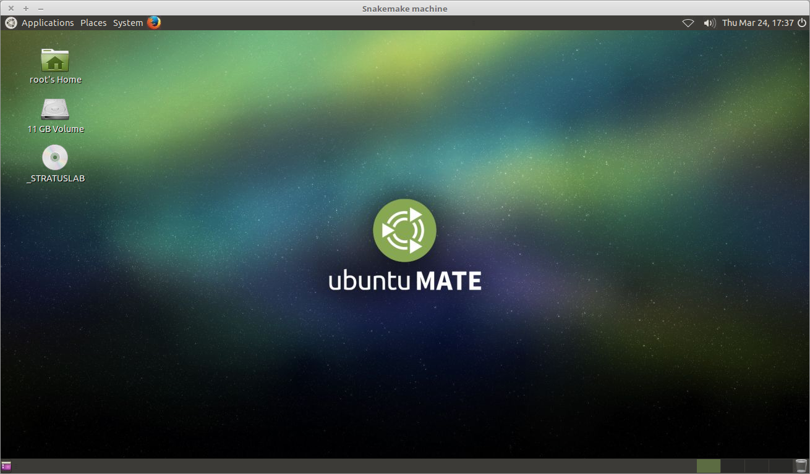

# Executing Snakemake workflows on a virtual machine

## User account creation & configuration

* Using the IFB cloud facilities requires to have a user account. Register [here](https://cloud.france-bioinformatique.fr/accounts/register/). 

* Once your account has been validated, you can [login](https://cloud.france-bioinformatique.fr/accounts/login/).

* In order to be able to access your instances through SSH, you should register your SSH public key in your [account settings](https://cloud.france-bioinformatique.fr/cloud/profile/), through the dashboard.

## Virtual disk creation

Appliances usually have a limited amount of disk space (up to 10, 20Go). If the instance to be run necessitates disk space, you have to create a virtual disk (vDisk) prior to launching it. By default, the capacity of storage granted to a user is 250Go, which can be divided into as many vDisks as necessary. When instantiating an appliance, you can chose to attach one of these vDIsks to the virtual machine. You'll be able to access data on this disk through SSH. 

1. Click *New vDisk* button.
2. Enter a size (whole number equating to the amount of Go needed). 
3. Name it.


## Creation of an instance

1. Click *New Instance* button.
2. Choose appliance "Ubuntu 14.04 IFB-X2GO-10GB" in the drop-down menu. 
3. Name your VM.
4. Choose the amount of CPU and RAM to grant the VM (up to 8 CPU, 32 GB RAM).
5. Attach the vDisk.
6. Click *Run*.


7. After a few seconds, you may refresh the page until the newly created instance shows up on the dashboard. Clicking on the ssh mention in the *Access* column will give you the commands to access your virtual machine. 


## Connection to the device

1. Type the command in a terminal.

```
ssh -A -p 22 root@192.54.201.124
```

## Basic installation

Once in the virtual machine, you can install the required programs. 

1. Clone the git sakemake repository and get inside.

```
git clone https://github.com/rioualen/gene-regulation.git
cd gene-regulation
```

2. Run makefile to install all required dependencies (this may take a while ~20mn?) & update `$PATH`.

```
make -f scripts/makefiles/makefile_install_dependencies all_install
PATH=~/bin:$PATH
```

## Run the workflow

The vDisk is automatically attached to the virtual machine, and is mounted by default under `/root/mydisk`.

1. Download source data on the vDisk. 

```
mkdir -p /root/mydisk/data/GSE20870/GSM521934 /root/mydisk/data/GSE20870/GSM521935
cd /root/mydisk/data/GSE20870/GSM521934
wget ftp://ftp-trace.ncbi.nlm.nih.gov/sra/sra-instant/reads/ByExp/sra/SRX%2FSRX021%2FSRX021358/SRR051929/SRR051929.sra
cd /root/mydisk/data/GSE20870/GSM521935
wget ftp://ftp-trace.ncbi.nlm.nih.gov/sra/sra-instant/reads/ByExp/sra/SRX%2FSRX021%2FSRX021359/SRR051930/SRR051930.sra
```

<!--
```
/data/
    GSE20870/
        GSM521934/
            SRR051929.sra
        GSM521935/
            SRR051930.sra
```
```
rsync -rtvplu /data/GSE20870 root@192.54.201.124:/data
```
-->

2. Run the workflow.

```
cd ~/gene-regulation
snakemake -p -s scripts/snakefiles/workflows/factor_workflow.py
```

Congratulations! You just executed this wonderful workflow:


## Visualize the results

The Virtual Machine created here doesn't have a graphical interface, so we're gonna use a distant desktop to visualize the results from the host machine. 

1. Install the x2go client and launch it from your local computer.

```
sudo apt-get install x2goclient
```

2. Copy your ssh key to the authorized keys of the virtual machine.

```
cat $HOME/.ssh/id_rsa.pub | ssh root@192.54.201.124 "cat >> .ssh/authorized_keys"
```

3. Launch client.

```
x2goclient
```

4. Create a new session using the Mate desktop.


5. The session now appears on the right panel. Just click it to lauch it!


6. You should be now on the virtual desktop!



7. You can visualize FastQC results using firefox.


8. You can visualize the peaks by running IGV from the terminal.

```
PATH=$PATH:/root/bin
igv
```
Click "File" > "Open session..." and chose the file `/root/mydisk/data/results/GSE20870/peaks/igv_session.xml`.


