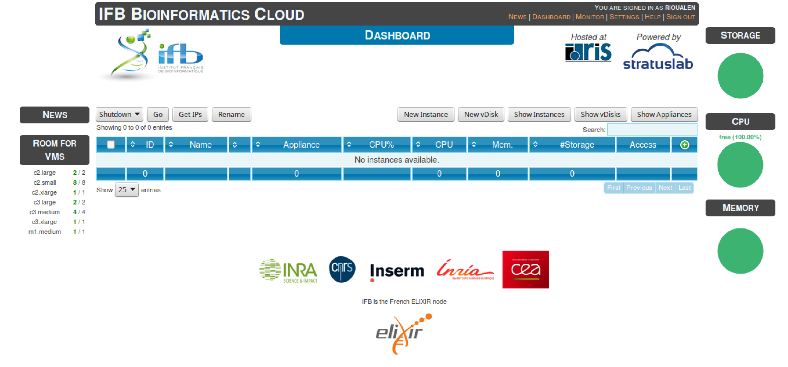
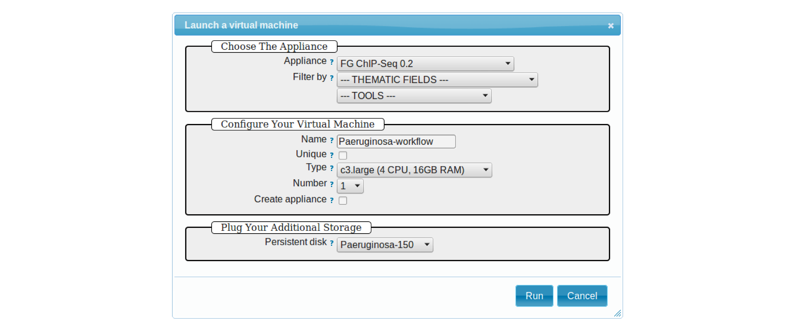

# IFB cloud utilities


The IFB cloud provides users with a number of bioinformatics facilities, under the form of ready-to-use *appliances*. A cloud appliance is a template or a virtual machine (VM) built with a bundle of scientific or utility software components that are already configured. Several appliances are dedicated to special fields of bioinformatics, such as proteomics, genomics... Some of them come with an HTML interface, such as Galaxy or RSAT.

The cloud also provides "basic" Ubuntu or CentOS appliances. Provided you hold a developper account, it allows you to instantiate a virtual machine, setup your own tools, and register it as a new appliance to be used again later on and even shared with other cloud users.

The official website is still under development. However, here are a few useful links:

* [The IFB](http://www.france-bioinformatique.fr/)

* [IFB cloud](http://www.france-bioinformatique.fr/en/cloud/)

* [Cloud usage](http://www.france-bioinformatique.fr/en/core/cloud-usage)

* [Documentation](http://www.france-bioinformatique.fr/en/cloud/doc-du-cloud)

## User account creation & configuration

* Using the IFB cloud facilities requires to have a user account. Register [here](https://cloud.france-bioinformatique.fr/accounts/register/). 

* Once your account has been validated, you can [login](https://cloud.france-bioinformatique.fr/accounts/login/).

* In order to be able to access your instances through SSH, you should register your SSH public key in your [account settings](https://cloud.france-bioinformatique.fr/cloud/profile/), through the dashboard.



# Using an existing appliance

## Virtual disk creation

Appliances usually have a limited amount of disk space (up 10, 20Go). If the instance to be run necessitates disk space, you have to create a virtual disk (vDisk) prior to launching it. By default, the capacity of storage granted to a user is 250Go, which can be divided into as many vDisks as necessary. When instantiating an appliance, you can chose to attach one of these vDIsks to the virtual machine. You'll be able to access data on this disk through SSH. 

1. Click *New vDisk* button.
2. Enter a size (whole number equating to the amount of Go needed). 
3. Name it.


## Creation of an instance

1. Click *New Instance* button.
2. Choose an appliance in the drop-down menu. You may use the filter menu in order to look for a specific tool. 
3. Name your VM.
4. Choose the amount of CPU and RAM to grant the VM (up to 8 CPU, 32 GB RAM).
5. Attach the vDisk.
6. Click *Run*.



7. After a few seconds, you may refresh the page until the newly created instance shows up on the dashboard. Clicking on the ssh mention in the *Access* column will give you the commands to access your virtual machine. 


8. If the appliance has an HTTP interface, a link will also be provided in the *Access* column. 

# Creation of an appliance

## Creation

Creating your own appliance can be as simple as instantiating an existing one. 

1. Click *New Instance* button.
2. Choose the appliance **Ubuntu 14.04 IFB-10G (2015-10)** or **CentOS 6.7 IFB-20G (2016-01)**. 
3. Name your instance.
4. Check **Create appliance**. 
5. Choose the amount of CPU and RAM to grant the VM (up to 8 CPU, 32 GB RAM).
6. Attach the vDisk.
7. Click *Run*.


8. Refresh the page. Your instance should appear in orange because of the creation mode you selected. You can now click on the **ssh** column to see the ssh parameters. It should look like this:


9. Connect to your VM by commandline.
```
ssh -A -p 22 root@192.54.201.111
```


## Configuration (optional)

### User account

Create user account and grant it sudo privileges (followed procedure [here](https://www.digitalocean.com/community/tutorials/how-to-add-and-delete-users-on-an-ubuntu-14-04-vps)).

### Shell coloring

```
nano ~/.bashrc
```
Fetch following paragraph and uncomment command `force-color`.
```
# uncomment for a colored prompt, if the terminal has the capability; turned
# off by default to not distract the user: the focus in a terminal window
# should be on the output of commands, not on the prompt
force_color_prompt=yes
```
```
source ~/.bashrc
```

## Data management

### Virtual disk

By default, if a vDisk has been attached to the VM, it is mounted under `/root/mydisk`. 

### Transfers

You can transfer data from your local computer to the VM using commands provided under *Access* > shh:
```
scp -P 22 ${localfile} root@192.54.201.111:
sftp -oPort=22 root@192.54.201.111
```
Another way is to use rsync:
```
rsync -ruptvl ${localfile} root@192.54.201.177:/root/mydisk/
```


# Then...

## Software installation

Once you're connected to the VM through ssh, you can install any program just the way you would do it locally (see this [manual](install_snakemake_workflows.Rmd) for instance).


## Documentation

### RSAT suite  

See [manual](install_rsat_ubuntu14.04.Rmd).

### Snakemake workflows

See [manual](install_snakemake_workflows.Rmd).


### VBox export / IFB appliance submission 

See [manual](export_appliance.Rmd). **(to be updated!)**


