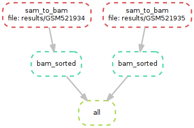
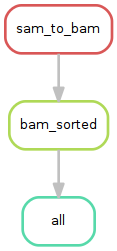

## Introduction

### Concepts

- Inspired by GNU Make: system of rules & targets
- A rule is the recipe for a target
- Rules are combined by matching their inputs and outputs

### Installation

```{shell}
pip3 install snakemake
```

### Download & exercise

```{shell}
git clone https://github.com/rioualen/gene-regulation.git
```
```{shell}
cd gene-regulation/doc/snakemake_tutorial
```

## Workflow 1: Rules and targets

- Only the first **rule** is executed by default
- Rule `all` defines the **target**
- Rule `sam_to_bam` automatically produces the target

```{python, eval=FALSE}
# file: workflow1.py
rule all:
    input: "GSM521934.bam"

rule sam_to_bam:
    input: "GSM521934.sam"
    output: "GSM521934.bam"
    shell: "samtools view {input} > {output}"
```

In the terminal:
```{shell}
snakemake -s workflow1/workflow1.py
```


## Workflow 2: Introducing wildcards

- **Wildcards** can replace variables
- Workflow applies to list of files or samples
- Use of the **expand** function

```{python, eval=FALSE}
# file: workflow2.py
SAMPLES = ["GSM521934", "GSM521935"]

rule all:
    input: expand("{sample}.bam", sample = SAMPLES)

rule sam_to_bam:
   input: "{file}.sam"
    output: "{file}.bam"
    shell: "samtools view {input} > {output}"
```

In the terminal:
```{shell}
snakemake -s workflow2/workflow2.py
```

## Workflow 3: Keywords

- Rules can use a variety of **keywords**
- An exhaustive list can be found [here](https://bitbucket.org/snakemake/snakemake/wiki/Documentation#markdown-header-grammar)

```{python, eval=FALSE}
# file: workflow3.py
SAMPLES = ["GSM521934", "GSM521935"]

rule all:
    input: expand("{sample}.bam", sample = SAMPLES)

rule sam_to_bam:
    input: "{file}.sam"
    output: "{file}.bam"
    params: threads = 2
    log: "{file}.log"
    benchmark: "{file}.json"
    shell: "(samtools view -bS --threads {params.threads} {input} > {output}) > {log}"
```

In the terminal:
```{shell}
snakemake -s workflow3/workflow3.py
```

## Workflow 4: Combining rules

- Dependencies are handled implicitly, by matching filenames
- Commands can be executed by keywords `run` or `shell`
- Several languages: `R`, `bash`, `python`

```{python, eval=FALSE}
# file: workflow4.py
from snakemake.utils import R

SAMPLES = ["GSM521934", "GSM521935"]

rule all:
    input: expand("{sample}_sorted.bam", sample = SAMPLES)

rule sam_to_bam:
    input: "{file}.sam"
    output: "{file}.bam"
    params: threads = 2
    log: "{file}.log"
    benchmark: "{file}.json"
    shell: "(samtools view -bS --threads {params.threads} {input} > {output}) > {log}"

rule bam_sorted:
    input: "{file}.bam"
    output: "{file}_sorted.bam"
    run:
        R("""
        library(Rsamtools)
        sortBam("{input}", "{output}")
        """)
```

In the terminal:
```{shell}
snakemake -s workflow4/workflow4.py
```

## Workflow 5: Configuration file

- Can be in `json` or in `yml` format
- Acessible through the global variable **config**

```{python, eval=FALSE}
# file: workflow5.py
from snakemake.utils import R

configfile: "config.yml"

SAMPLES = config["samples"].split()
OUTDIR = config["outdir"]

rule all:
    input: expand(OUTDIR + "{sample}_sorted.bam", sample = SAMPLES)

rule sam_to_bam:
    input: "{file}.sam"
    output: "{file}.bam"
    params: threads = config["samtools"]["threads"]
    log: "{file}.log"
    benchmark: "{file}.json"
    shell: "(samtools view -bS --threads {params.threads} {input} > {output}) > {log}"

rule bam_sorted:
    input: "{file}.bam"
    output: "{file}_sorted.bam"
    run:
        R("""
        library(Rsamtools)
        sortBam("{input}", "{output}")
        """)
```

```{yaml, eval=FALSE}
# file: config.yml
  samples: "GSM521934 GSM521935" 
  outdir: "/home/rioualen/Desktop/workspace/snakemake_howto/results/"
  samtools:
    threads: "2"
```

In the terminal:
```{shell}
snakemake -s workflow5/workflow5.py
```

## Workflow 6: Separated files

- The keyword `include` is used to import rules

```{python, eval=FALSE}
# file: workflow6.py
from snakemake.utils import R

configfile: "config.yml"

SAMPLES = config["samples"].split()
OUTDIR = config["outdir"]

include: "sam_to_bam.rules"
include: "bam_sorted.rules"

rule all:
    input: expand(OUTDIR + "{sample}_sorted.bam", sample = SAMPLES)
```

```{python, eval=FALSE}
# file: sam_to_bam.rules
rule sam_to_bam:
    input: "{file}.sam"
    output: "{file}.bam"
    params: threads = config["samtools"]["threads"]
    log: "{file}.log"
    benchmark: "{file}.json"
    shell: "(samtools view -bS --threads {params.threads} {input} > {output}) > {log}"
    ```
    
```{python, eval=FALSE}
# file: bam_sorted.rules
rule bam_sorted:
    input: "{file}.bam"
    output: "{file}_sorted.bam"
    run:
        R("""
        library(Rsamtools)
        sortBam("{input}", "{output}")
        """)
```

In the terminal:
```{shell}
snakemake -s workflow6/workflow6.py
```

## Bonus: generating flowcharts

```{shell}
snakemake -s workflow6/workflow6.py --dag | dot -Tpng -o d.png
snakemake -s workflow6/workflow6.py --rulegraph | dot -Tpng -o r.png
```

  

## More on snakemake...

### Documentation

* [Manual](https://bitbucket.org/snakemake/snakemake/wiki/Documentation)
* [FAQ](https://bitbucket.org/snakemake/snakemake/wiki/FAQ)
* [Forum](https://groups.google.com/forum/#!forum/snakemake)

<!--[](http://snakemake.bitbucket.org)-->

### Installation

```{shell}
apt-get install python3-pip
pip3 install snakemake
```

### Reference

Köster, Johannes and Rahmann, Sven. "Snakemake - A scalable bioinformatics workflow engine". Bioinformatics 2012.
