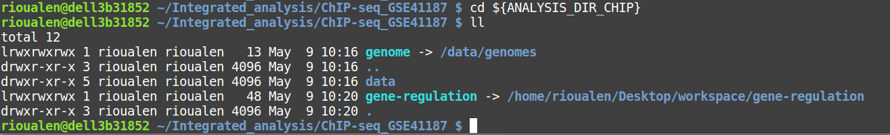
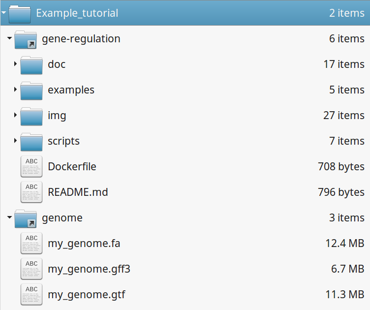
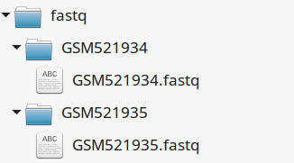
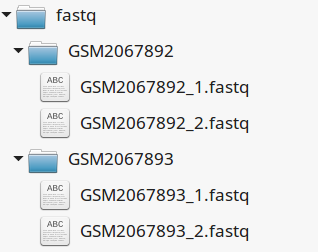
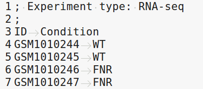
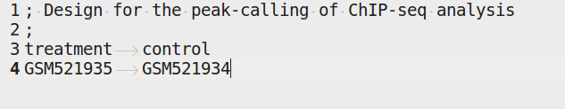
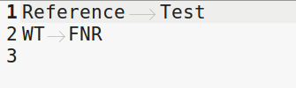
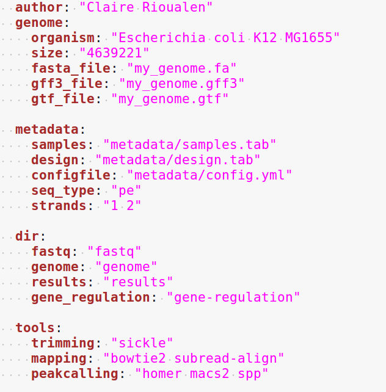
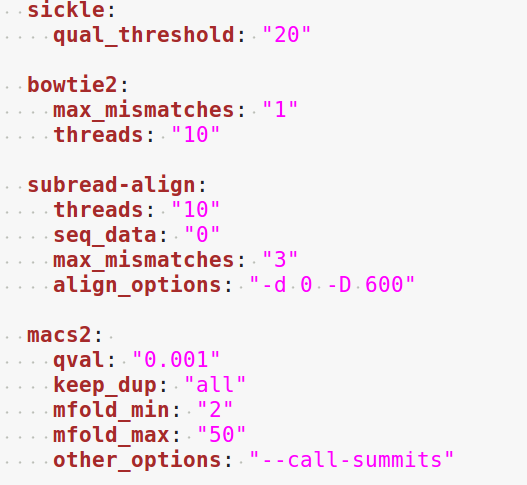
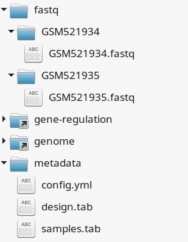

Tutorials
================================================================

Initial setup
----------------------------------------------------------------

Gene-regulation library
~~~~~~~~~~~~~~~~~~~~~~~~~~~~~~~~~~~~~~~~~~~~~~~~~~~~~~~~~~~~~~~

For each study presented here we're creating a link to the gene-regulation library, 
previously downloaded in section "Quick start". 

Note: if you're using a clone of the library, 
you might want to make a copy of it, in order to ensure consistency 
for later analyses.

Genome directory
~~~~~~~~~~~~~~~~~~~~~~~~~~~~~~~~~~~~~~~~~~~~~~~~~~~~~~~~~~~~~~~

We chose to define a permanent location for genome downloads, then 
create symlinks for study cases. 

::

    GENOME_DIR=$HOME/genome
    mkdir ${GENOME_DIR}

ChIP-seq study case in *S. cerevisiae*
----------------------------------------------------------------

Presentation
~~~~~~~~~~~~~~~~~~~~~~~~~~~~~~~~~~~~~~~~~~~~~~~~~~~~~~~~~~~~~~~

**Reference**

Preti M, Ribeyre C, Pascali C, Bosio MC et al. The telomere-binding
protein Tbf1 demarcates snoRNA gene promoters in Saccharomyces
cerevisiae. Mol Cell 2010 May 28;38(4):614-20. PMID: 20513435

**Abstract**

Small nucleolar RNAs (snoRNAs) play a key role in ribosomal RNA biogenesis, 
yet factors controlling their expression are unknown. We found that 
the majority of Saccharomyces snoRNA promoters display an aRCCCTaa sequence motif 
at the upstream border of a TATA-containing nucleosome-free region. 
Genome-wide ChIP-seq analysis showed that these motifs are bound by Tbf1, 
a telomere-binding protein known to recognize mammalian-like T(2)AG(3) 
repeats at subtelomeric regions. Tbf1 has over 100 additional promoter targets, 
including several other genes involved in ribosome biogenesis and the TBF1 gene itself. 
Tbf1 is required for full snoRNA expression, yet it does not influence 
nucleosome positioning at snoRNA promoters. In contrast, Tbf1 contributes to 
nucleosome exclusion at non-snoRNA promoters, where it selectively colocalizes 
with the Tbf1-interacting zinc-finger proteins Vid22 and Ygr071c. 
Our data show that, besides the ribosomal protein gene regulator Rap1, 
a second telomere-binding protein also functions as a transcriptional regulator linked to yeast ribosome biogenesis.

**Access link**

- GEO series: `GSE20870 <http://www.ncbi.nlm.nih.gov/geo/query/acc.cgi?acc=GSE20870>`__

Download reference genome & annotations
****************************************************************

::

    mkdir ${GENOME_DIR}/sacCer2
    wget -nc ftp://ftp.ensemblgenomes.org/pub/fungi/release-30/fasta/saccharomyces_cerevisiae/dna/Saccharomyces_cerevisiae.R64-1-1.30.dna.genome.fa.gz -P${GENOME_DIR}/sacCer2
    wget -nc ftp://ftp.ensemblgenomes.org/pub/fungi/release-30/gff3/saccharomyces_cerevisiae/Saccharomyces_cerevisiae.R64-1-1.30.gff3.gz -P ${GENOME_DIR}/sacCer2
    wget -nc ftp://ftp.ensemblgenomes.org/pub/fungi/release-30/gtf/saccharomyces_cerevisiae/Saccharomyces_cerevisiae.R64-1-1.30.gtf.gz -P ${GENOME_DIR}/sacCer2
    gunzip ${GENOME_DIR}/sacCer2/*.gz

Setup analysis environment
****************************************************************

::

    ANALYSIS_DIR=$HOME/ChIP-seq_GSE20870
    mkdir -p ${ANALYSIS_DIR}
    cd ${ANALYSIS_DIR}
    ln -s ${GENE_REG_PATH} gene-regulation
    ln -s ${GENOME_DIR}/sacCer2 genome
    CONFIG=${ANALYSIS_DIR}/gene-regulation/examples/ChIP-seq_SE_GSE20870/config.yml

Download data
****************************************************************

::

    mkdir -p ${ANALYSIS_DIR}/data/GSM521934 ${ANALYSIS_DIR}/data/GSM521935
    wget --no-clobber ftp://ftp-trace.ncbi.nlm.nih.gov/sra/sra-instant/reads/ByExp/sra/SRX%2FSRX021%2FSRX021358/SRR051929/SRR051929.sra -P ${ANALYSIS_DIR}/data/GSM521934
    wget --no-clobber ftp://ftp-trace.ncbi.nlm.nih.gov/sra/sra-instant/reads/ByExp/sra/SRX%2FSRX021%2FSRX021359/SRR051930/SRR051930.sra -P ${ANALYSIS_DIR}/data/GSM521935

*show file arborescence*

Workflow 'import_from_sra'
~~~~~~~~~~~~~~~~~~~~~~~~~~~~~~~~~~~~~~~~~~~~~~~~~~~~~~~~~~~~~~~~

The purpose of this workflow is to convert .sra files to .fastq files. 
The .sra format (Short Read Archive) is used by the GEO database, but 
for downstream analyses we need to dispose of fastq-formatted files. 
You can check out the `glossary
<http://gene-regulation.readthedocs.io/en/latest/wiki.html#glossary>`_ to find out more about file formats. 

It order to run it, you must have followed sections "Setup analysis environment" 
and "Download data" for the dataset GSE20870. 

Workflow execution
****************************************************************

::

    snakemake -s ${ANALYSIS_DIR}/gene-regulation/scripts/snakefiles/workflows/import_from_sra.wf -p --configfile ${CONFIG}

*show file arborescence*

Workflow 'quality_control'
~~~~~~~~~~~~~~~~~~~~~~~~~~~~~~~~~~~~~~~~~~~~~~~~~~~~~~~~~~~~~~~~

This workflow can be run after the workflow 'import_from_sra', or directly on properly-organized fastq files 
(see `this section
<http://gene-regulation.readthedocs.io/en/latest/tutorials.html#running-gene-regulation-workflows-on-your-own-data>`_ if you dispose of your own data).

The purpose of this workflow is to perform quality check with `FastQC https://www.bioinformatics.babraham.ac.uk/projects/fastqc/`_. 

Optionally, trimming can be performed using the tools `Sickle <https://github.com/najoshi/sickle>`_. or `Cutadapt <http://cutadapt.readthedocs.io/en/stable/>`_.

::

    cd ${ANALYSIS_DIR}

*show file arborescence*

Workflow execution
****************************************************************

::

    snakemake -s ${ANALYSIS_DIR}/gene-regulation/scripts/snakefiles/workflows/quality_control.wf -p --configfile ${CONFIG}

*show arborescence and/or FastQC screencaps*

Workflow 'ChIP-seq'
~~~~~~~~~~~~~~~~~~~~~~~~~~~~~~~~~~~~~~~~~~~~~~~~~~~~~~~~~~~~~~~~

This workflows performs:
 - mapping with various algorithms;
 - genome coverage in different formats (check out our `glossary
<http://gene-regulation.readthedocs.io/en/latest/wiki.html#glossary>`_);
 - peak-calling with various algorithms;
 - motifs search using the `RSAT suite <rsat.eu>`_. 

It order to run it, you must have followed sections "Setup analysis environment",
 "Download data", and "Download genome and annotation" for the dataset GSE20870. 

You must have run at least the workflow "import_from_sra', and optionally the workflow "quality_control". 

Workflow execution
****************************************************************

::

    cd ${ANALYSIS_DIR}
    snakemake -s ${ANALYSIS_DIR}/gene-regulation/scripts/snakefiles/workflows/ChIP-seq.wf -p --configfile ${CONFIG}

*rulegraph + screencap*

Genome-scale analysis of *Escherichia coli* FNR
----------------------------------------------------------------

Presentation
~~~~~~~~~~~~~~~~~~~~~~~~~~~~~~~~~~~~~~~~~~~~~~~~~~~~~~~~~~~~~~~

**Reference**

Myers KS, Yan H, Ong IM, Chung D et al. Genome-scale analysis of
Escherichia coli FNR reveals complex features of transcription factor
binding. PLoS Genet 2013 Jun;9(6):e1003565. PMID:
`23818864 <http://www.ncbi.nlm.nih.gov/pubmed/23818864>`__

**GEO series**

- ChIP-seq: `GSE41187 <http://www.ncbi.nlm.nih.gov/geo/query/acc.cgi?acc=GSE41187>`__
- RNA-seq: `GSE41190 <http://www.ncbi.nlm.nih.gov/geo/query/acc.cgi?acc=GSE41190>`__

Download reference genome & annotations
****************************************************************

::

    mkdir ${GENOME_DIR}/Ecoli-K12
    wget -nc ftp://ftp.ensemblgenomes.org/pub/release-21/bacteria/fasta/bacteria_22_collection/escherichia_coli_str_k_12_substr_mg1655/dna/Escherichia_coli_str_k_12_substr_mg1655.GCA_000005845.1.21.dna.genome.fa.gz -P ${GENOME_DIR}/Ecoli-K12
    wget -nc ftp://ftp.ensemblgenomes.org/pub/release-21/bacteria/gff3/bacteria_22_collection/escherichia_coli_str_k_12_substr_mg1655/Escherichia_coli_str_k_12_substr_mg1655.GCA_000005845.1.21.gff3.gz -P ${GENOME_DIR}/Ecoli-K12
    wget -nc ftp://ftp.ensemblgenomes.org/pub/release-21/bacteria/gtf/bacteria_22_collection/escherichia_coli_str_k_12_substr_mg1655/Escherichia_coli_str_k_12_substr_mg1655.GCA_000005845.1.21.gtf.gz -P ${GENOME_DIR}/Ecoli-K12
    gunzip ${GENOME_DIR}/Ecoli-K12/*.gz

Setup analysis environment
****************************************************************

::

    ANALYSIS_DIR=${HOME}/Integrated_analysis

Workflow 'ChIP-seq'
~~~~~~~~~~~~~~~~~~~~~~~~~~~~~~~~~~~~~~~~~~~~~~~~~~~~~~~~~~~~~~~~

Setup analysis environment
****************************************************************

::

    ANALYSIS_DIR_CHIP=${ANALYSIS_DIR}/ChIP-seq_GSE41187
    mkdir -p ${ANALYSIS_DIR_CHIP} 
    ln -s ${GENE_REG_PATH} ${ANALYSIS_DIR_CHIP}/gene-regulation             # ${GENE_REG_PATH} should have been defined beforehand
    ln -s ${GENOME_DIR} ${ANALYSIS_DIR_CHIP}/genome                         # ${GENOME_DIR} should have been defined beforehand
    CONFIG_CHIP=${ANALYSIS_DIR_CHIP}/gene-regulation/examples/ChIP-seq_SE_GSE41187/config.yml

Download ChIP-seq data 
****************************************************************

::

    mkdir -p ${ANALYSIS_DIR_CHIP}/data/GSM1010224 ${ANALYSIS_DIR_CHIP}/data/GSM1010219 ${ANALYSIS_DIR_CHIP}/data/GSM1010220
    wget --no-clobber ftp://ftp-trace.ncbi.nlm.nih.gov/sra/sra-instant/reads/ByExp/sra/SRX%2FSRX189%2FSRX189778/SRR576938/SRR576938.sra -P ${ANALYSIS_DIR_CHIP}/data/GSM1010224
    wget --no-clobber ftp://ftp-trace.ncbi.nlm.nih.gov/sra/sra-instant/reads/ByExp/sra/SRX%2FSRX189%2FSRX189773/SRR576933/SRR576933.sra -P ${ANALYSIS_DIR_CHIP}/data/GSM1010219
    wget --no-clobber ftp://ftp-trace.ncbi.nlm.nih.gov/sra/sra-instant/reads/ByExp/sra/SRX/SRX189/SRX189774/SRR576934/SRR576934.sra -P ${ANALYSIS_DIR_CHIP}/data/GSM1010220

Workflow execution
****************************************************************

Your directory should now look like this:

And you should be able to execute it like this:

::

    snakemake -s ${ANALYSIS_DIR_CHIP}/gene-regulation/scripts/snakefiles/workflows/import_from_sra.wf -p --configfile ${CONFIG_CHIP}
    snakemake -s ${ANALYSIS_DIR_CHIP}/gene-regulation/scripts/snakefiles/workflows/quality_control.wf -p --configfile ${CONFIG_CHIP}
    snakemake -s ${ANALYSIS_DIR_CHIP}/gene-regulation/scripts/snakefiles/workflows/ChIP-seq.wf -p --configfile ${CONFIG_CHIP}

Workflow 'RNA-seq' DEG
~~~~~~~~~~~~~~~~~~~~~~~~~~~~~~~~~~~~~~~~~~~~~~~~~~~~~~~~~~~~~~~~

Setup analysis environment
****************************************************************

::

    ANALYSIS_DIR_RNA=${ANALYSIS_DIR}/RNA-seq_GSE41190
    mkdir ${ANALYSIS_DIR_RNA}
    ln -s ${GENE_REG_PATH} ${ANALYSIS_DIR_RNA}/gene-regulation
    ln -s ${GENOME_DIR} ${ANALYSIS_DIR_RNA}/genome
    CONFIG_RNA=${ANALYSIS_DIR_RNA}/gene-regulation/examples/RNA-seq_PE_GSE41190/config.yml

Download RNA-seq data
****************************************************************

::

    mkdir -p ${ANALYSIS_DIR_RNA}/data/GSM1010244 ${ANALYSIS_DIR_RNA}/data/GSM1010245 ${ANALYSIS_DIR_RNA}/data/GSM1010246 ${ANALYSIS_DIR_RNA}/data/GSM1010247
    wget --no-clobber ftp://ftp-trace.ncbi.nlm.nih.gov/sra/sra-instant/reads/ByExp/sra/SRX/SRX264/SRX2641374/SRR5344681/SRR5344681.sra -P ${ANALYSIS_DIR_RNA}/data/GSM1010244
    wget --no-clobber ftp://ftp-trace.ncbi.nlm.nih.gov/sra/sra-instant/reads/ByExp/sra/SRX/SRX264/SRX2641375/SRR5344682/SRR5344682.sra -P ${ANALYSIS_DIR_RNA}/data/GSM1010245
    wget --no-clobber ftp://ftp-trace.ncbi.nlm.nih.gov/sra/sra-instant/reads/ByExp/sra/SRX/SRX264/SRX2641376/SRR5344683/SRR5344683.sra -P ${ANALYSIS_DIR_RNA}/data/GSM1010246
    wget --no-clobber ftp://ftp-trace.ncbi.nlm.nih.gov/sra/sra-instant/reads/ByExp/sra/SRX/SRX264/SRX2641377/SRR5344684/SRR5344684.sra -P ${ANALYSIS_DIR_RNA}/data/GSM1010247

Workflow execution
****************************************************************

::

    snakemake -s ${ANALYSIS_DIR_RNA}/gene-regulation/scripts/snakefiles/workflows/import_from_sra.wf -p --configfile ${CONFIG_RNA}
    snakemake -s ${ANALYSIS_DIR_RNA}/gene-regulation/scripts/snakefiles/workflows/quality_control.wf -p --configfile ${CONFIG_RNA}
    snakemake -s ${ANALYSIS_DIR_RNA}/gene-regulation/scripts/snakefiles/workflows/RNA-seq_workflow_PE.py -p --configfile ${CONFIG_RNA}

.. figure:: ../examples/RNA-seq_PE_GSE41190/rulegraph.png
   :alt: 

Workflow 'integrated_ChIP_RNA'
~~~~~~~~~~~~~~~~~~~~~~~~~~~~~~~~~~~~~~~~~~~~~~~~~~~~~~~~~~~~~~~~

*todo*

*Study case yet to find*
----------------------------------------------------------------

Workflow alternative transcripts
~~~~~~~~~~~~~~~~~~~~~~~~~~~~~~~~~~~~~~~~~~~~~~~~~~~~~~~~~~~~~~~~

*Study case yet to find*
----------------------------------------------------------------

Workflow orthologs
~~~~~~~~~~~~~~~~~~~~~~~~~~~~~~~~~~~~~~~~~~~~~~~~~~~~~~~~~~~~~~~~

*todo after we revise the Glossine dataset analysis*

Running Gene-regulation workflows on your own data
----------------------------------------------------------------

Gene-regulation library & genome data
~~~~~~~~~~~~~~~~~~~~~~~~~~~~~~~~~~~~~~~~~~~~~~~~~~~~~~~~~~~~~~~~

Assuming you have followed section "Initial setup", you should 
have defined a location for the genome files and the Gene-regulation 
library. 

Hereafter is a suggestion for the organization of your files.

::

    ANALYSIS_DIR=/your/directory
    mkdir -p ${ANALYSIS_DIR}
    cd ${ANALYSIS_DIR}
    ln -s ${GENE_REG_PATH} gene-regulation
    ln -s ${GENOME_DIR} genome

Your directory should look like this:

Fastq files organization
~~~~~~~~~~~~~~~~~~~~~~~~~~~~~~~~~~~~~~~~~~~~~~~~~~~~~~~~~~~~~~~~

This tutorial assumes you dispose of your own fastq files. 
We recommend that your organise your samples in separate folders, 
and name both fastq files and their parent directories accordingly. 

If you have paired-ends samples, they should be in the same 
directory and distinguished using a suffix of any sort.

Metadata
~~~~~~~~~~~~~~~~~~~~~~~~~~~~~~~~~~~~~~~~~~~~~~~~~~~~~~~~~~~~~~~~

Running the workflows provided by the Gene-regulation library 
requires the use of three configuration files. 

samples.tab
****************************************************************

This file should contain, at least, one column named "ID", that 
should contain sample names matching those defined in the previous section. 
In the case of an RNA-seq analysis, it should also contain a column "Condition", 
which will define groups of comparison (see design file in the section below).

All the samples will be processed in the same manner. You can prevent certain 
samples from being processed by commenting the corresponding lines with a ";" 
at the beginning of the line. 

RNA-seq sample groups should contain at least 2 sampples. 

You can add any other relevant information related to samples in other 
tab-separated columns. 

.. figure:: ../img/samples_file_ChIP.png
   :alt: 

design.tab
****************************************************************

The purpose of this file is to determine which samples should be processed 
together. In a ChIP-seq analysis, it will be used to define which ChIP samples should be 
compared with which inputs. In an RNA-seq experiment, it defines the conditions to be compared 
against each other. 

Column names should be respected. 

config.yml
****************************************************************

You can find examples of configuration files in the examples section of 
the gene-regulation directory. 

Directories should be defined relative to the working directory 
defined in the beginning: genome, gene-regulation, fastq, etc. 
Same goes for configuration files.

Genome filenames should be mentionned as they appear in the defined genome 
directory. 

Genome size should be filled in, as well as the sequencing type: 
"se" for single-end data, and "pe" for paired-ends data. 
In the case of paired-ends data, suffixes (parameter "strands") 
should be mentioned and should match the filenames (minus the "_"). 

The minimum of configuration should look like this:

All the parameters related to the tools used are optional, and the default 
parameters of each program will be used when they're not set in the configfile. 

Running a workflow
~~~~~~~~~~~~~~~~~~~~~~~~~~~~~~~~~~~~~~~~~~~~~~~~~~~~~~~~~~~~~~~~

If your directory now looks like this, you should be ready to run a worflow!

::

    cd ${ANALYSIS_DIR}
    snakemake -s gene-regulation/scripts/snakefiles/workflows/quality_control.wf --config-file metadata/config.yml -pn
    snakemake -s gene-regulation/scripts/snakefiles/workflows/ChIP-seq.wf --config-file metadata/config.yml -pn

