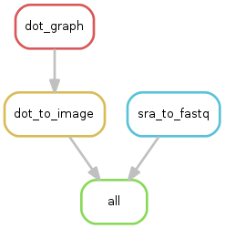
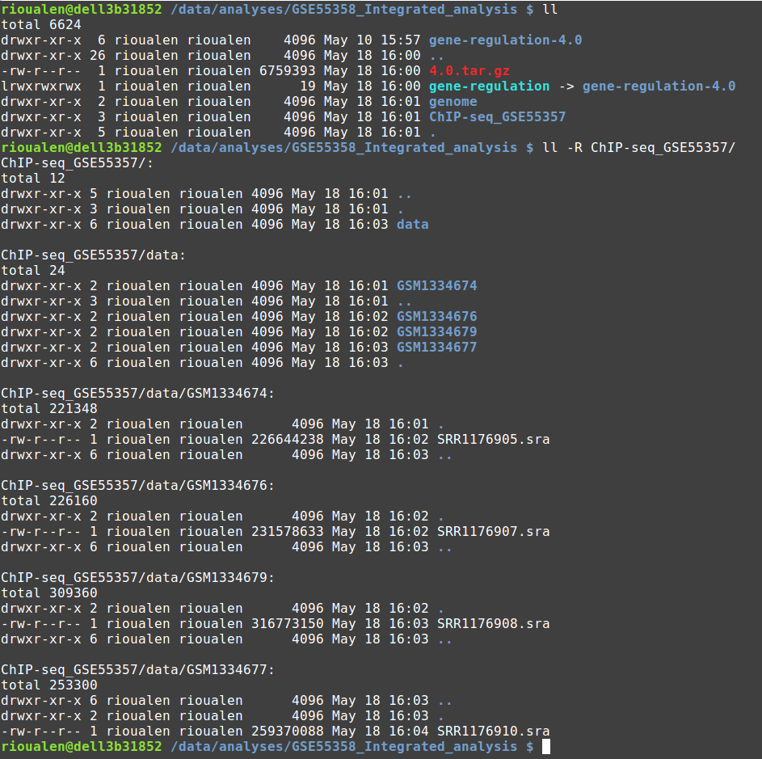
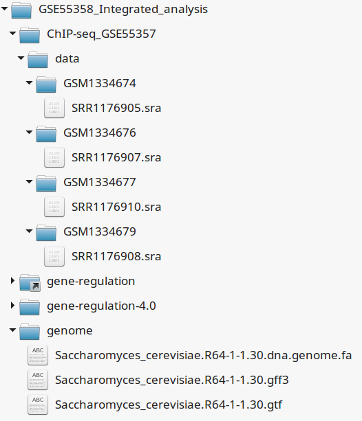
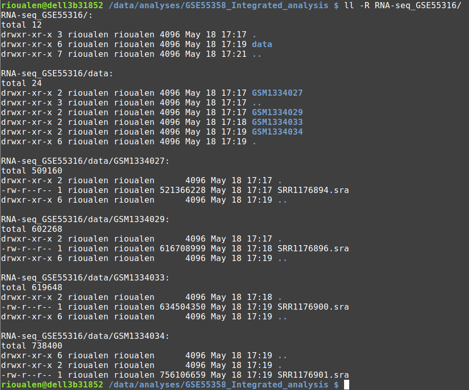

Tutorials
================================================================

ChIP-seq analysis
----------------------------------------------------------------

Case: ChIP-seq study of Tbf1 in *S. cerevisiae*
~~~~~~~~~~~~~~~~~~~~~~~~~~~~~~~~~~~~~~~~~~~~~~~~~~~~~~~~~~~~~~~~

**Reference**

Preti M, Ribeyre C, Pascali C, Bosio MC et al. The telomere-binding
protein Tbf1 demarcates snoRNA gene promoters in Saccharomyces
cerevisiae. Mol Cell 2010 May 28;38(4):614-20. PMID: 20513435

**Abstract**

Small nucleolar RNAs (snoRNAs) play a key role in ribosomal RNA biogenesis, 
yet factors controlling their expression are unknown. We found that 
the majority of Saccharomyces snoRNA promoters display an aRCCCTaa sequence motif 
at the upstream border of a TATA-containing nucleosome-free region. 
Genome-wide ChIP-seq analysis showed that these motifs are bound by Tbf1, 
a telomere-binding protein known to recognize mammalian-like T(2)AG(3) 
repeats at subtelomeric regions. Tbf1 has over 100 additional promoter targets, 
including several other genes involved in ribosome biogenesis and the TBF1 gene itself. 
Tbf1 is required for full snoRNA expression, yet it does not influence 
nucleosome positioning at snoRNA promoters. In contrast, Tbf1 contributes to 
nucleosome exclusion at non-snoRNA promoters, where it selectively colocalizes 
with the Tbf1-interacting zinc-finger proteins Vid22 and Ygr071c. 
Our data show that, besides the ribosomal protein gene regulator Rap1, 
a second telomere-binding protein also functions as a transcriptional regulator linked to yeast ribosome biogenesis.

**Access link**

- GEO series: `GSE20870 <http://www.ncbi.nlm.nih.gov/geo/query/acc.cgi?acc=GSE20870>`__

Setup analysis environment
****************************************************************

Here, we create a directory that will contain the raw data, the Gene-regulation library, 
the reference genome data and the results of the workflow(s) used. 

We are going to use a global variable: $ANALYSIS_DIR. 

::

    ANALYSIS_DIR=$HOME/ChIP-seq_GSE20870
    mkdir -p ${ANALYSIS_DIR}
    cd ${ANALYSIS_DIR}

Download Gene-regulation
****************************************************************

We are going to download the Gene-regulation library in the analysis directory. 
Another possibility would be to download Gene-regulation in a fixed place, and create a symlink 
to the analysis directory. 

::

    wget --no-clobber https://github.com/rioualen/gene-regulation/archive/4.0.tar.gz 
    tar xvzf 4.0.tar.gz
    ln -s gene-regulation-4.0 gene-regulation

Download reference genome & annotations
****************************************************************

Here, we are going to download the geneome sequence and annotation files in the analysis directory. 
It is also possible to define a fixed location to store genomes and then create a symlink to it. 

It can be useful to store all the genomes in one place, in order to avoid duplication of 
big files. Also, most mapping algorithms need to index the genome before proceeding with 
the alignment. This index needs only be done once, but it takes time and storage space, so it's better to avoid 
duplicating it. 

::

    mkdir ${ANALYSIS_DIR}/genome
    wget -nc ftp://ftp.ensemblgenomes.org/pub/fungi/release-30/fasta/saccharomyces_cerevisiae/dna/Saccharomyces_cerevisiae.R64-1-1.30.dna.genome.fa.gz -P ${ANALYSIS_DIR}/genome
    wget -nc ftp://ftp.ensemblgenomes.org/pub/fungi/release-30/gff3/saccharomyces_cerevisiae/Saccharomyces_cerevisiae.R64-1-1.30.gff3.gz -P ${ANALYSIS_DIR}/genome
    wget -nc ftp://ftp.ensemblgenomes.org/pub/fungi/release-30/gtf/saccharomyces_cerevisiae/Saccharomyces_cerevisiae.R64-1-1.30.gtf.gz -P ${ANALYSIS_DIR}/genome
    gunzip ${ANALYSIS_DIR}/genome/*.gz

Download raw data
****************************************************************

::

    mkdir -p ${ANALYSIS_DIR}/data/GSM521934 ${ANALYSIS_DIR}/data/GSM521935
    wget --no-clobber ftp://ftp-trace.ncbi.nlm.nih.gov/sra/sra-instant/reads/ByExp/sra/SRX%2FSRX021%2FSRX021358/SRR051929/SRR051929.sra -P ${ANALYSIS_DIR}/data/GSM521934
    wget --no-clobber ftp://ftp-trace.ncbi.nlm.nih.gov/sra/sra-instant/reads/ByExp/sra/SRX%2FSRX021%2FSRX021359/SRR051930/SRR051930.sra -P ${ANALYSIS_DIR}/data/GSM521935

Workflow 'import_from_sra'
~~~~~~~~~~~~~~~~~~~~~~~~~~~~~~~~~~~~~~~~~~~~~~~~~~~~~~~~~~~~~~~~

The purpose of this workflow is to convert .sra files to .fastq files. 
The .sra format (Short Read Archive) is used by the GEO database, but 
for downstream analyses we need to dispose of fastq-formatted files. 
You can check out the `glossary
<http://gene-regulation.readthedocs.io/en/latest/wiki.html#glossary>`_ to find out more about file formats. 

Workflow execution
****************************************************************

If you have followed the previous steps, you have a file organization that looks like this: 

.. figure:: ../img/data_tuto.png
   :alt: 

You should then be able to run the following command: 

::

    cd ${ANALYSIS_DIR}
    snakemake -s gene-regulation/scripts/snakefiles/workflows/import_from_sra.wf -p --configfile gene-regulation/examples/ChIP-seq_SE_GSE20870/config.yml

Workflow 'quality_control'
~~~~~~~~~~~~~~~~~~~~~~~~~~~~~~~~~~~~~~~~~~~~~~~~~~~~~~~~~~~~~~~~

This workflow can be run after the workflow 'import_from_sra', or directly on properly-organized fastq files 
(see `this section
<http://gene-regulation.readthedocs.io/en/latest/tutorials.html#running-gene-regulation-workflows-on-your-own-data>`_ if you dispose of your own data).

The purpose of this workflow is to perform quality check with `FastQC https://www.bioinformatics.babraham.ac.uk/projects/fastqc/`_. 

Optionally, trimming can be performed using the tools `Sickle <https://github.com/najoshi/sickle>`_. or `Cutadapt <http://cutadapt.readthedocs.io/en/stable/>`_.

Workflow execution
****************************************************************

::

    cd ${ANALYSIS_DIR}
    snakemake -s gene-regulation/scripts/snakefiles/workflows/quality_control.wf -p --configfile gene-regulation/examples/ChIP-seq_SE_GSE20870/config.yml

.. figure:: ../img/quality_control_rulegraph.png
   :alt: 

Workflow 'ChIP-seq'
~~~~~~~~~~~~~~~~~~~~~~~~~~~~~~~~~~~~~~~~~~~~~~~~~~~~~~~~~~~~~~~~

This workflows performs:
 - mapping with various algorithms
 - genome coverage in different formats (check out our `glossary
<http://gene-regulation.readthedocs.io/en/latest/wiki.html#glossary>`_)
 - peak-calling with various algorithms
 - motifs search using the `RSAT suite <rsat.eu>`_

You must have run at least the workflow "import_from_sra", and optionally the workflow "quality_control". 

Workflow execution
****************************************************************

::

    cd ${ANALYSIS_DIR}
    snakemake -s gene-regulation/scripts/snakefiles/workflows/ChIP-seq.wf -p --configfile gene-regulation/examples/ChIP-seq_SE_GSE20870/config.yml

.. figure:: ../img/ChIP-seq_rulegraph.png
   :alt: 

Integration: ChIP-seq and RNA-seq workflows
----------------------------------------------------------------

Case: Genomic analysis of the scc2-4 mutant in budding yeast
~~~~~~~~~~~~~~~~~~~~~~~~~~~~~~~~~~~~~~~~~~~~~~~~~~~~~~~~~~~~~~~

**Reference**

Genomic analysis of the scc2-4 mutant in budding yeast

Musinu Zakari

**GEO series**

- ChIP-seq: `GSE55357 <http://www.ncbi.nlm.nih.gov/geo/query/acc.cgi?acc=GSE55357>`__
- RNA-seq: `GSE55316 <http://www.ncbi.nlm.nih.gov/geo/query/acc.cgi?acc=GSE55316>`__

Setup workdir
****************************************************************

::

    ANALYSIS_DIR=$HOME/GSE55358_Integrated_analysis
    mkdir ${ANALYSIS_DIR}
    cd ${ANALYSIS_DIR}

Download the Gene-regulation library
****************************************************************

::

    wget --no-clobber https://github.com/rioualen/gene-regulation/archive/4.0.tar.gz 
    tar xvzf 4.0.tar.gz
    ln -s gene-regulation-4.0 gene-regulation

Download reference genome & annotations
****************************************************************

::

    wget -nc ftp://ftp.ensemblgenomes.org/pub/fungi/release-30/fasta/saccharomyces_cerevisiae/dna/Saccharomyces_cerevisiae.R64-1-1.30.dna.genome.fa.gz -P ${ANALYSIS_DIR}/genome
    wget -nc ftp://ftp.ensemblgenomes.org/pub/fungi/release-30/gff3/saccharomyces_cerevisiae/Saccharomyces_cerevisiae.R64-1-1.30.gff3.gz -P ${ANALYSIS_DIR}/genome
    wget -nc ftp://ftp.ensemblgenomes.org/pub/fungi/release-30/gtf/saccharomyces_cerevisiae/Saccharomyces_cerevisiae.R64-1-1.30.gtf.gz -P ${ANALYSIS_DIR}/genome
    gunzip ${ANALYSIS_DIR}/genome/*.gz

Workflow 'ChIP-seq'
~~~~~~~~~~~~~~~~~~~~~~~~~~~~~~~~~~~~~~~~~~~~~~~~~~~~~~~~~~~~~~~~

Download ChIP-seq data 
****************************************************************

::

    wget --no-clobber ftp://ftp-trace.ncbi.nlm.nih.gov/sra/sra-instant/reads/ByExp/sra/SRX/SRX476/SRX476133/SRR1176905/SRR1176905.sra -P ${ANALYSIS_DIR}/ChIP-seq_GSE55357/data/GSM1334674
    wget --no-clobber ftp://ftp-trace.ncbi.nlm.nih.gov/sra/sra-instant/reads/ByExp/sra/SRX/SRX476/SRX476135/SRR1176907/SRR1176907.sra -P ${ANALYSIS_DIR}/ChIP-seq_GSE55357/data/GSM1334676
    wget --no-clobber ftp://ftp-trace.ncbi.nlm.nih.gov/sra/sra-instant/reads/ByExp/sra/SRX/SRX476/SRX476136/SRR1176908/SRR1176908.sra -P ${ANALYSIS_DIR}/ChIP-seq_GSE55357/data/GSM1334679
    wget --no-clobber ftp://ftp-trace.ncbi.nlm.nih.gov/sra/sra-instant/reads/ByExp/sra/SRX/SRX476/SRX476138/SRR1176910/SRR1176910.sra -P ${ANALYSIS_DIR}/ChIP-seq_GSE55357/data/GSM1334677

Workflow execution
****************************************************************

Your directory should now look like this: 

And you should be able to execute it like this: 

::

    cd ${ANALYSIS_DIR}
    snakemake -s gene-regulation/scripts/snakefiles/workflows/import_from_sra.wf -p --configfile gene-regulation/examples/ChIP-seq_GSE55357/config.yml
    snakemake -s gene-regulation/scripts/snakefiles/workflows/quality_control.wf -p --configfile gene-regulation/examples/ChIP-seq_GSE55357/config.yml
    snakemake -s gene-regulation/scripts/snakefiles/workflows/ChIP-seq.wf -p --configfile gene-regulation/examples/ChIP-seq_GSE55357/config.yml

Workflow 'RNA-seq' DEG
~~~~~~~~~~~~~~~~~~~~~~~~~~~~~~~~~~~~~~~~~~~~~~~~~~~~~~~~~~~~~~~~

Download RNA-seq data
****************************************************************

::

    wget --no-clobber ftp://ftp-trace.ncbi.nlm.nih.gov/sra/sra-instant/reads/ByExp/sra/SRX/SRX476/SRX476122/SRR1176894/SRR1176894.sra -P ${ANALYSIS_DIR}/RNA-seq_GSE55316/data/GSM1334027
    wget --no-clobber ftp://ftp-trace.ncbi.nlm.nih.gov/sra/sra-instant/reads/ByExp/sra/SRX/SRX476/SRX476124/SRR1176896/SRR1176896.sra -P ${ANALYSIS_DIR}/RNA-seq_GSE55316/data/GSM1334029
    wget --no-clobber ftp://ftp-trace.ncbi.nlm.nih.gov/sra/sra-instant/reads/ByExp/sra/SRX/SRX476/SRX476128/SRR1176900/SRR1176900.sra -P ${ANALYSIS_DIR}/RNA-seq_GSE55316/data/GSM1334033
    wget --no-clobber ftp://ftp-trace.ncbi.nlm.nih.gov/sra/sra-instant/reads/ByExp/sra/SRX/SRX476/SRX476129/SRR1176901/SRR1176901.sra -P ${ANALYSIS_DIR}/RNA-seq_GSE55316/data/GSM1334034

Workflow execution
****************************************************************

Your directory should now look like this: 

And you should be able to execute it like this: 

::

    cd ${ANALYSIS_DIR}
    snakemake -s gene-regulation/scripts/snakefiles/workflows/import_from_sra.wf -p --configfile gene-regulation/examples/RNA-seq_GSE55316/config.yml
    snakemake -s gene-regulation/scripts/snakefiles/workflows/quality_control.wf -p --configfile gene-regulation/examples/RNA-seq_GSE55316/config.yml
    snakemake -s gene-regulation/scripts/snakefiles/workflows/RNA-seq.wf -p --configfile gene-regulation/examples/RNA-seq_GSE55316/config.yml

Workflow 'integration_ChIP_RNA'
~~~~~~~~~~~~~~~~~~~~~~~~~~~~~~~~~~~~~~~~~~~~~~~~~~~~~~~~~~~~~~~~

*coming soon*

.. *Study case yet to find*
.. ----------------------------------------------------------------
.. Workflow alternative transcripts
.. ~~~~~~~~~~~~~~~~~~~~~~~~~~~~~~~~~~~~~~~~~~~~~~~~~~~~~~~~~~~~~~~~
.. *Study case yet to find*
.. ----------------------------------------------------------------
.. Workflow orthologs
.. ~~~~~~~~~~~~~~~~~~~~~~~~~~~~~~~~~~~~~~~~~~~~~~~~~~~~~~~~~~~~~~~~
.. *todo after we revise the Glossine dataset analysis*

Running Gene-regulation workflows on your own data
----------------------------------------------------------------

Gene-regulation library & genome data
~~~~~~~~~~~~~~~~~~~~~~~~~~~~~~~~~~~~~~~~~~~~~~~~~~~~~~~~~~~~~~~~

Assuming you have followed section "Initial setup", you should 
have defined a location for the genome files and the Gene-regulation 
library. 

You should dispose of 3 files related to your reference genome:

- a fasta file
- a gff3 annotation file
- a gtf annotation file

Hereafter is a suggestion for the organization of your files.

::

    ANALYSIS_DIR=$HOME/my_analysis
    mkdir -p ${ANALYSIS_DIR}
    cd ${ANALYSIS_DIR}

::

    # Download the Gene-regulation library
    wget --no-clobber https://github.com/rioualen/gene-regulation/archive/4.0.tar.gz 
    tar xvzf 4.0.tar.gz
    ln -s gene-regulation-4.0 gene-regulation

::

    wget -nc <URL_to_my_genome.fa.gz> -P ${ANALYSIS_DIR}/genome
    wget -nc <URL_to_my_genome.gff3.gz> -P ${ANALYSIS_DIR}/genome
    wget -nc <URL_to_my_genome.gtf.gz> -P ${ANALYSIS_DIR}/genome
    gunzip ${ANALYSIS_DIR}/genome/*.gz

    ln -s ${GENE_REG_PATH} gene-regulation
    ln -s ${GENOME_DIR}/my_genome_dir genome

Your directory should look like this:

.. figure:: ../img/analysis_dir_example.png
   :alt: 

Fastq files organization
~~~~~~~~~~~~~~~~~~~~~~~~~~~~~~~~~~~~~~~~~~~~~~~~~~~~~~~~~~~~~~~~

This tutorial assumes you dispose of your own fastq files. 
We recommend that your organise your samples in separate folders, 
and name both fastq files and their parent directories accordingly. 

.. figure:: ../img/fastq_orga.png
   :alt: 

If you have paired-ends samples, they should be in the same 
directory and distinguished using a suffix of any sort.

.. figure:: ../img/fastq_dir_pe.png
   :alt: 

Metadata
~~~~~~~~~~~~~~~~~~~~~~~~~~~~~~~~~~~~~~~~~~~~~~~~~~~~~~~~~~~~~~~~

Running the workflows provided by the Gene-regulation library 
requires the use of three configuration files. 

samples.tab
****************************************************************

This file should contain, at least, one column named "ID", that 
should contain sample names matching those defined in the previous section. 
In the case of an RNA-seq analysis, it should also contain a column "Condition", 
which will define groups of comparison (see design file in the section below).

All the samples will be processed in the same manner. You can prevent certain 
samples from being processed by commenting the corresponding lines with a ";" 
at the beginning of the line. 

RNA-seq sample groups should contain at least 2 samples. 

You can add any other relevant information related to samples in other 
tab-separated columns. 

.. figure:: ../img/samples_file_ChIP.png
   :alt: ChIP-seq example
   :name: ChIP-seq example

.. figure:: ../img/samples_file_RNA.png
   :alt: RNA-seq example
   :name: RNA-seq example

design.tab
****************************************************************

The purpose of this file is to determine which samples should be processed 
together. In a ChIP-seq analysis, it will be used to define which ChIP samples should be 
compared with which inputs. In an RNA-seq experiment, it defines the conditions to be compared 
against each other. 

Column names should be respected. 

.. figure:: ../img/design_file_ChIP.png
   :alt: 

.. figure:: ../img/design_file_RNA.png
   :alt: 

config.yml
****************************************************************

You can find examples of configuration files in the examples section of 
the gene-regulation directory. 

Directories should be defined relative to the working directory 
defined in the beginning: genome, gene-regulation, fastq, etc. 
Same goes for configuration files.

Genome filenames should be mentionned as they appear in the defined genome 
directory. 

Genome size should be filled in, as well as the sequencing type: 
"se" for single-end data, and "pe" for paired-ends data. 
In the case of paired-ends data, suffixes (parameter "strands") 
should be mentioned and should match the filenames (minus the "_"). 

The minimum of configuration should look like this:

.. figure:: ../img/config_file_required.png
   :alt: 

All the parameters related to the tools used are optional, and the default 
parameters of each program will be used when they're not set in the configfile. 

.. figure:: ../img/config_file_optional.png
   :alt: 

Running a workflow
~~~~~~~~~~~~~~~~~~~~~~~~~~~~~~~~~~~~~~~~~~~~~~~~~~~~~~~~~~~~~~~~

If your directory now looks like this, you should be ready to run a worflow!

.. figure:: ../img/file_orga_ready.png
   :alt: 

You can verify it by doing dry runs:

::

    cd ${ANALYSIS_DIR}
    # Run the quality check
    snakemake -s gene-regulation/scripts/snakefiles/workflows/quality_control.wf --config-file metadata/config.yml -p -n
    # Run the ChIP-seq workflow
    snakemake -s gene-regulation/scripts/snakefiles/workflows/ChIP-seq.wf --config-file metadata/config.yml -p -n
    # Run the RNA-seq workflow
    snakemake -s gene-regulation/scripts/snakefiles/workflows/RNA-seq.wf --config-file metadata/config.yml -p -n

Just remove the `-n` option to actually run them. 

