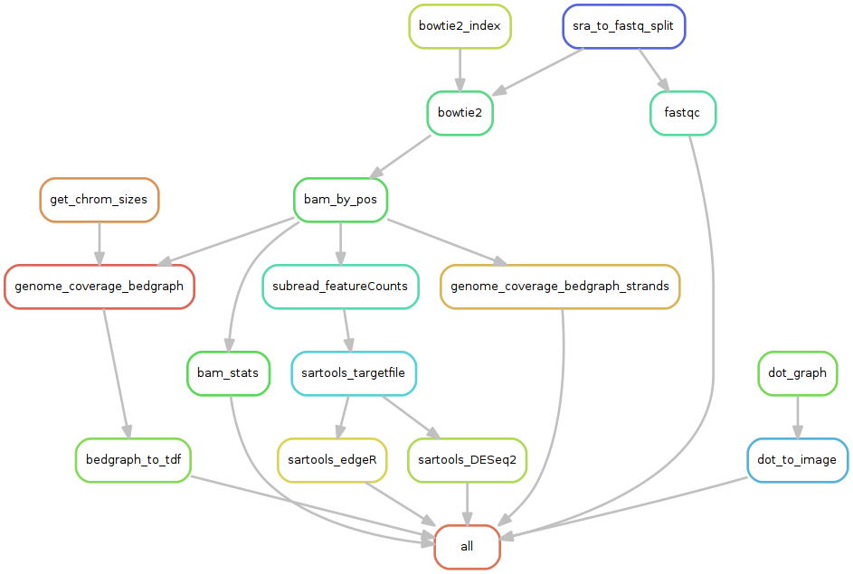

# Study case for the development of a Bacterial RNA-seq workflow


## Data source

**Reference** 

Myers KS, Yan H, Ong IM, Chung D et al. Genome-scale analysis of escherichia coli FNR reveals complex features of transcription factor binding. PLoS Genet 2013 Jun;9(6):e1003565. PMID: [23818864](http://www.ncbi.nlm.nih.gov/pubmed/23818864)


**GEO series**

[GSE41190](http://www.ncbi.nlm.nih.gov/geo/query/acc.cgi?acc=GSE41190)

## File organisation

Short read files (.sra) are stored in sample-specific folders named data/source/[GSM_ID].
In this dataset, there is a single run per sample, and thus a single sra file per GSM ID. 


## Setup analysis environment
```
ANALYSIS_DIR=/your/preferred/dir/RNA-seq_PE_GSE41190

mkdir -p ${ANALYSIS_DIR}

cd ${ANALYSIS_DIR}
git clone https://github.com/rioualen/gene-regulation.git 
<!--TODO: replace with tar.gz download of gene-regulation-v3.0-->
```

## Download data
<!-- Old data (still downloadable)
```
mkdir -p ${ANALYSIS_DIR}/data/GSM1010244 ${ANALYSIS_DIR}/data/GSM1010245 ${ANALYSIS_DIR}/data/GSM1010246 ${ANALYSIS_DIR}/data/GSM1010247
wget --no-clobber ftp://ftp-trace.ncbi.nlm.nih.gov/sra/sra-instant/reads/ByExp/sra/SRX%2FSRX059%2FSRX059774/SRR191809/SRR191809.sra -P ${ANALYSIS_DIR}/data/GSM1010244
wget --no-clobber ftp://ftp-trace.ncbi.nlm.nih.gov/sra/sra-instant/reads/ByExp/sra/SRX%2FSRX059%2FSRX059768/SRR191805/SRR191805.sra -P ${ANALYSIS_DIR}/data/GSM1010245
wget --no-clobber ftp://ftp-trace.ncbi.nlm.nih.gov/sra/sra-instant/reads/ByExp/sra/SRX%2FSRX059%2FSRX059767/SRR191812/SRR191812.sra -P ${ANALYSIS_DIR}/data/GSM1010246
wget --no-clobber ftp://ftp-trace.ncbi.nlm.nih.gov/sra/sra-instant/reads/ByExp/sra/SRX%2FSRX059%2FSRX059767/SRR191812/SRR191812.sra -P ${ANALYSIS_DIR}/data/GSM1010247
```
-->

<!--Note: sample GSM1010247 is oddly formatted, so for we use a trick to run the workflow, by duplicating GSM1010245-->
<!--wget --no-clobber ftp://ftp-trace.ncbi.nlm.nih.gov/sra/sra-instant/reads/ByExp/sra/SRX%2FSRX116%2FSRX116381/SRR400301/SRR400301.sra -P ${ANALYSIS_DIR}/data/GSM1010247-->


```
mkdir -p ${ANALYSIS_DIR}/data/GSM1010244 ${ANALYSIS_DIR}/data/GSM1010245 ${ANALYSIS_DIR}/data/GSM1010246 ${ANALYSIS_DIR}/data/GSM1010247
wget --no-clobber ftp://ftp-trace.ncbi.nlm.nih.gov/sra/sra-instant/reads/ByExp/sra/SRX/SRX264/SRX2641374/SRR5344681/SRR5344681.sra -P ${ANALYSIS_DIR}/data/GSM1010244
wget --no-clobber ftp://ftp-trace.ncbi.nlm.nih.gov/sra/sra-instant/reads/ByExp/sra/SRX/SRX264/SRX2641375/SRR5344682/SRR5344682.sra -P ${ANALYSIS_DIR}/data/GSM1010245
wget --no-clobber ftp://ftp-trace.ncbi.nlm.nih.gov/sra/sra-instant/reads/ByExp/sra/SRX/SRX264/SRX2641376/SRR5344683/SRR5344683.sra -P ${ANALYSIS_DIR}/data/GSM1010246
wget --no-clobber ftp://ftp-trace.ncbi.nlm.nih.gov/sra/sra-instant/reads/ByExp/sra/SRX/SRX264/SRX2641377/SRR5344684/SRR5344684.sra -P ${ANALYSIS_DIR}/data/GSM1010247
```

## Download reference genome & annotations
```
wget -nc ftp://ftp.ensemblgenomes.org/pub/release-21/bacteria/fasta/bacteria_22_collection/escherichia_coli_str_k_12_substr_mg1655/dna/Escherichia_coli_str_k_12_substr_mg1655.GCA_000005845.1.21.dna.genome.fa.gz -P ${ANALYSIS_DIR}/genome
wget -nc ftp://ftp.ensemblgenomes.org/pub/release-21/bacteria/gff3/bacteria_22_collection/escherichia_coli_str_k_12_substr_mg1655/Escherichia_coli_str_k_12_substr_mg1655.GCA_000005845.1.21.gff3.gz -P ${ANALYSIS_DIR}/genome
wget -nc ftp://ftp.ensemblgenomes.org/pub/release-21/bacteria/gtf/bacteria_22_collection/escherichia_coli_str_k_12_substr_mg1655/Escherichia_coli_str_k_12_substr_mg1655.GCA_000005845.1.21.gtf.gz -P ${ANALYSIS_DIR}/genome
gunzip ${ANALYSIS_DIR}/genome/*.gz
```

## Execute workflow
```
snakemake -s ${ANALYSIS_DIR}/gene-regulation/scripts/snakefiles/workflows/RNA-seq_workflow_PE.py -p -j 5 --configfile ${ANALYSIS_DIR}/gene-regulation/examples/RNA-seq_PE_GSE41190/config.yml
```
## Rulegraph




