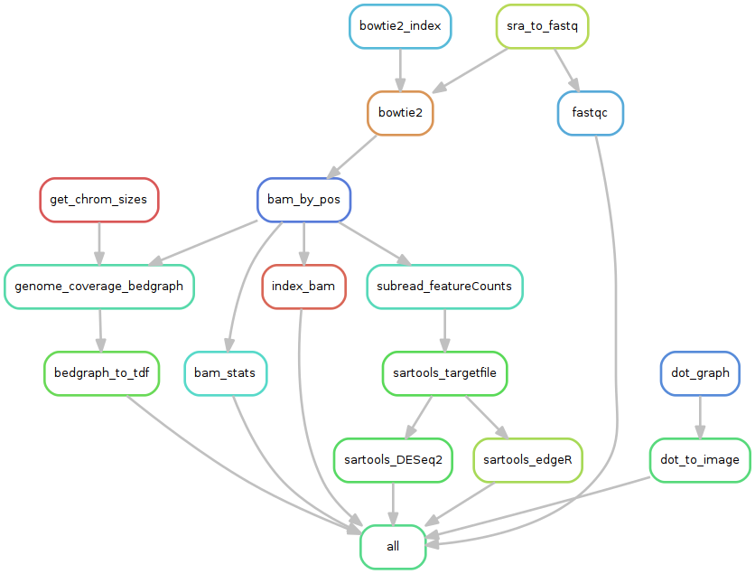

# Study case for the development of a Bacterial RNA-seq workflow

## Data

Reference: 
    GEO series: [GSE71562](http://www.ncbi.nlm.nih.gov/geo/query/acc.cgi?acc=GSE71562)

## File organisation

Short read files (.sra) are stored in sample-specific folders named data/source/[GSM_ID].
In this dataset, there is a single run per sample, and thus a single sra file per GSM ID. 

## Setup analysis environment

ANALYSIS_DIR=/data/analyses/RNA-seq_SE_GSE71562

mkdir -p ${ANALYSIS_DIR}
mkdir -p ${ANALYSIS_DIR}/data 
mkdir -p ${ANALYSIS_DIR}/genome

cd ${ANALYSIS_DIR}
<!--git clone https://github.com/rioualen/gene-regulation.git -->
<!--TODO: replace with tar.gz download of gene-regulation-v3.0-->
ln -s ~/Desktop/workspace/gene-regulation

## Download data

mkdir -p ${ANALYSIS_DIR}/data/GSM1838496 ${ANALYSIS_DIR}/data/GSM1838502 ${ANALYSIS_DIR}/data/GSM1838508 
mkdir -p ${ANALYSIS_DIR}/data/GSM1838499 ${ANALYSIS_DIR}/data/GSM1838505 ${ANALYSIS_DIR}/data/GSM1838511
mkdir -p ${ANALYSIS_DIR}/data/GSM1838501 ${ANALYSIS_DIR}/data/GSM1838507 ${ANALYSIS_DIR}/data/GSM1838513

wget --no-clobber ftp://ftp-trace.ncbi.nlm.nih.gov/sra/sra-instant/reads/ByExp/sra/SRX/SRX112/SRX1125282/SRR2135663/SRR2135663.sra -P ${ANALYSIS_DIR}/data/GSM1838496
wget --no-clobber ftp://ftp-trace.ncbi.nlm.nih.gov/sra/sra-instant/reads/ByExp/sra/SRX/SRX112/SRX1125288/SRR2135669/SRR2135669.sra -P ${ANALYSIS_DIR}/data/GSM1838502
wget --no-clobber ftp://ftp-trace.ncbi.nlm.nih.gov/sra/sra-instant/reads/ByExp/sra/SRX/SRX112/SRX1125294/SRR2135675/SRR2135675.sra -P ${ANALYSIS_DIR}/data/GSM1838508

wget --no-clobber ftp://ftp-trace.ncbi.nlm.nih.gov/sra/sra-instant/reads/ByExp/sra/SRX/SRX112/SRX1125285/SRR2135666/SRR2135666.sra -P ${ANALYSIS_DIR}/data/GSM1838499
wget --no-clobber ftp://ftp-trace.ncbi.nlm.nih.gov/sra/sra-instant/reads/ByExp/sra/SRX/SRX112/SRX1125291/SRR2135672/SRR2135672.sra -P ${ANALYSIS_DIR}/data/GSM1838505
wget --no-clobber ftp://ftp-trace.ncbi.nlm.nih.gov/sra/sra-instant/reads/ByExp/sra/SRX/SRX112/SRX1125297/SRR2135678/SRR2135678.sra -P ${ANALYSIS_DIR}/data/GSM1838511

wget --no-clobber ftp://ftp-trace.ncbi.nlm.nih.gov/sra/sra-instant/reads/ByExp/sra/SRX/SRX112/SRX1125287/SRR2135668/SRR2135668.sra -P ${ANALYSIS_DIR}/data/GSM1838501
wget --no-clobber ftp://ftp-trace.ncbi.nlm.nih.gov/sra/sra-instant/reads/ByExp/sra/SRX/SRX112/SRX1125293/SRR2135674/SRR2135674.sra -P ${ANALYSIS_DIR}/data/GSM1838507
wget --no-clobber ftp://ftp-trace.ncbi.nlm.nih.gov/sra/sra-instant/reads/ByExp/sra/SRX/SRX112/SRX1125299/SRR2135680/SRR2135680.sra -P ${ANALYSIS_DIR}/data/GSM1838513

## Download reference genome & annotations

wget -nc ftp://ftp.ensemblgenomes.org/pub/release-21/bacteria/fasta/bacteria_22_collection/escherichia_coli_str_k_12_substr_mg1655/dna/Escherichia_coli_str_k_12_substr_mg1655.GCA_000005845.1.21.dna.genome.fa.gz -P ${ANALYSIS_DIR}/genome
wget -nc ftp://ftp.ensemblgenomes.org/pub/release-21/bacteria/gff3/bacteria_22_collection/escherichia_coli_str_k_12_substr_mg1655/Escherichia_coli_str_k_12_substr_mg1655.GCA_000005845.1.21.gff3.gz -P ${ANALYSIS_DIR}/genome
wget -nc ftp://ftp.ensemblgenomes.org/pub/release-21/bacteria/gtf/bacteria_22_collection/escherichia_coli_str_k_12_substr_mg1655/Escherichia_coli_str_k_12_substr_mg1655.GCA_000005845.1.21.gtf.gz -P ${ANALYSIS_DIR}/genome
gunzip ${ANALYSIS_DIR}/genome/*.gz

## Execute workflow

snakemake -s ${ANALYSIS_DIR}/gene-regulation/scripts/snakefiles/workflows/RNA-seq_workflow_SE.py -p -j 5 --configfile ${ANALYSIS_DIR}/gene-regulation/examples/RNA-seq_SE_GSE71562/config.yml

## Rulegraph

